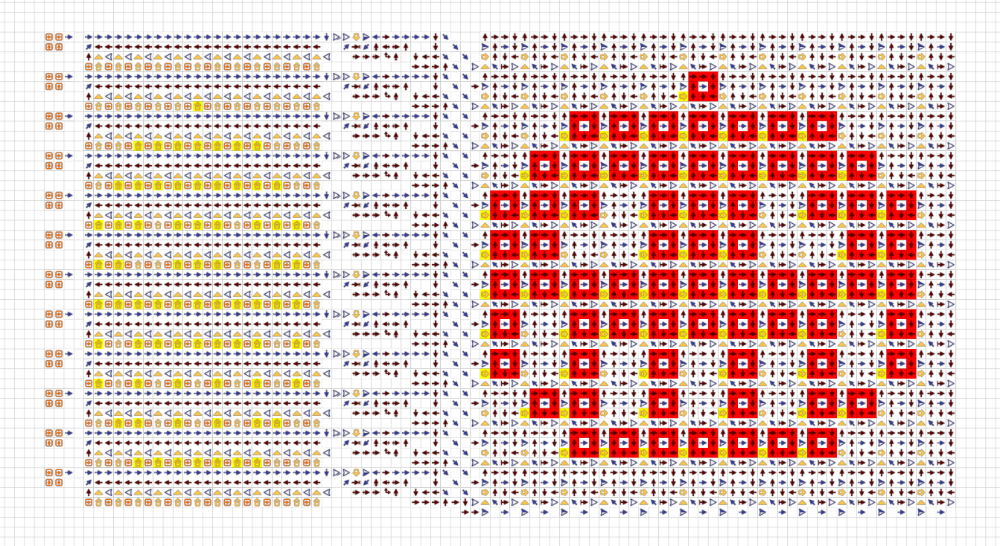
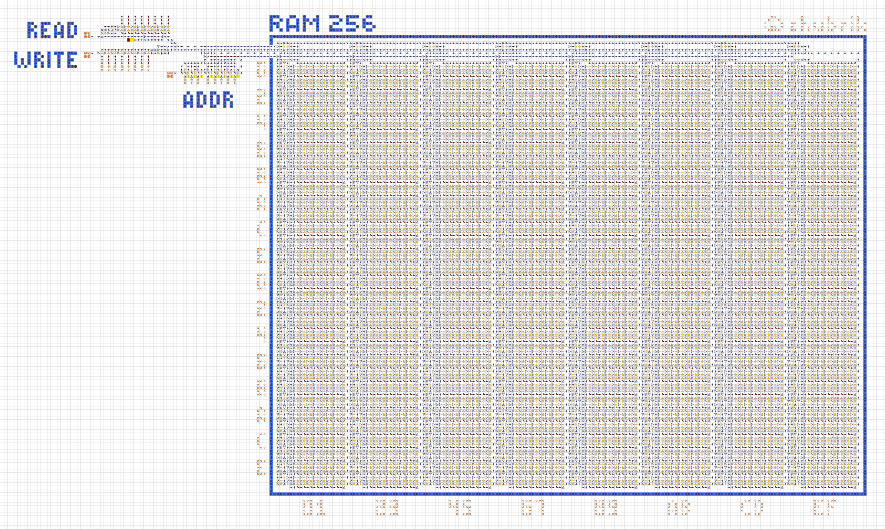

# Стрелочки
Моя коллекция карт, созданных в игре [«Стрелочки»](https://logic-arrows.io/) от [Onigiri](https://github.com/ArtemOnigiri).
  

Об игре от автора: 

  

## Мои карты

### [Жизнь](https://logic-arrows.io/map-life)

  

### [Матрица](https://logic-arrows.io/map-matrix)

  

### [Матрица RGB](https://logic-arrows.io/map-matrix-rgb)

  

### [Матрица маленькая](https://logic-arrows.io/map-CcGrVgC8)

  

### [Память 256 байт](https://logic-arrows.io/map-ram256)

  

### [Память 64 байта](https://logic-arrows.io/map-ram64)

  

### [Цифровой дисплей](https://logic-arrows.io/map-Xhj9Pead)

  

### [Процессор](https://logic-arrows.io/map-kBhOopki)

  

### [Передатчик](https://logic-arrows.io/map-Io2FESYk)

  

### [Вентили](https://logic-arrows.io/map-k_R4pB1A)

  

### [Умножитель](https://logic-arrows.io/map-lF-KRVo4vtw)

  

### [Сумматор](https://logic-arrows.io/map-5bk8IiWhZ6Q)

  

### [Вычитатель](https://logic-arrows.io/map-GvPsAA38)

  
