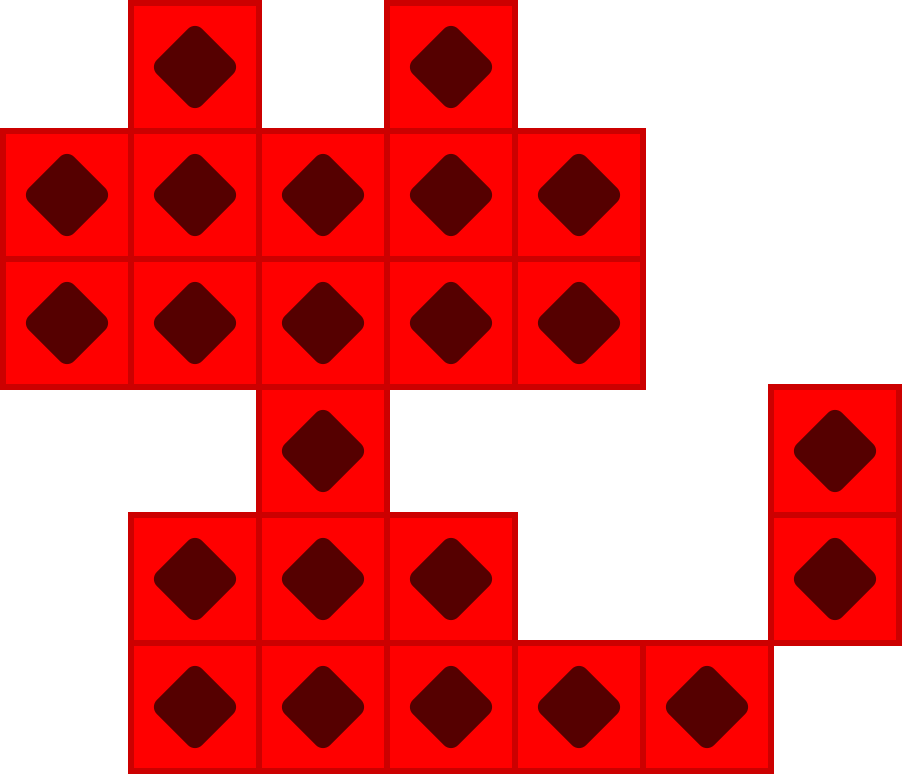

#  Logic Arrows

&nbsp;
&nbsp;&nbsp;&nbsp;
🌐 English | [Русский](ru/README.md)

A collection of maps in [“Logic Arrows”](https://logic-arrows.io/) — a browser game where complex
logic circuits are assembled from simple arrows on a grid. Every map can be opened and run right
in the browser: from gates and adders to full-fledged computers with programs and games. The
computers come with detailed documentation — structure, their own assembler, and the source code
of all programs.

- [Maps](#maps)
- [About](#about)
- [Links](#links)
  

## Maps

<table>
  <thead>
    <tr>
      <td valign="top" width="50%">
        <h3>
          <a href="computer-v2/README.md">
             
            Computer v2
          </a>
        </h3>
        <b>The flagship project.</b> A computer with its own assembler, programs, and games: Tetris,
        Game of Life, Arkanoid, 3D Maze, and more. Actively discussed and developed in the community
        of Logic Arrows enthusiasts.  
      </td>
      <td valign="top">
        <h3>
          <a href="computer-v1/README.md">
             
            Computer v1
          </a>
        </h3>
        The first version of the computer. It was created based on a physical prototype and helped
        master the construction of complex circuits.  
      </td>
    </tr>
  </thead>
</table>

<table>
  <thead>
    <tr>
      <td valign="top" width="33%">
        <a href="https://logic-arrows.io/map-life">
           
          <b>Game of Life</b>
        </a>  
      </td>
      <td valign="top" width="33%">
        <a href="https://logic-arrows.io/map-matrix">
           
          <b>Matrix</b>
        </a>  
      </td>
      <td valign="top" width="33%">
        <a href="https://logic-arrows.io/map-matrix-rgb">
           
          <b>Matrix RGB</b>
        </a>  
      </td>
    </tr>
    <tr>
      <td valign="top">
        <a href="https://logic-arrows.io/map-CcGrVgC8">
           
          <b>Compact Matrices</b>
        </a>  
      </td>
      <td valign="top">
        <a href="https://logic-arrows.io/map-fsG82aDy">
           
          <b>RAM 32K</b>
        </a>  
      </td>
      <td valign="top">
        <a href="https://logic-arrows.io/map-ram256">
           
          <b>RAM 256 v2</b>
        </a>  
      </td>
    </tr>
    <tr>
      <td valign="top">
        <a href="https://logic-arrows.io/map-utcKt1dM">
           
          <b>RAM 256 v1</b>
        </a>  
      </td>
      <td valign="top">
        <a href="https://logic-arrows.io/map-ram64">
           
          <b>RAM 64</b>
        </a>  
      </td>
      <td valign="top">
        <a href="https://logic-arrows.io/map-FI3Ue08n">
           
          <b>Compact ROM</b>
        </a>  
      </td>
    </tr>
    <tr>
      <td valign="top">
        <a href="https://logic-arrows.io/map-0TNlFXRQa6Y">
           
          <b>BCD Converter</b>
        </a>  
      </td>
      <td valign="top">
        <a href="https://logic-arrows.io/map-Xhj9Pead">
           
          <b>Segment Displays</b>
        </a>  
      </td>
      <td valign="top">
        <a href="https://logic-arrows.io/map-kBhOopki">
           
          <b>CPU Prototype</b>
        </a>  
      </td>
    </tr>
    <tr>
      <td valign="top">
        <a href="https://logic-arrows.io/map-Io2FESYk">
           
          <b>Transmitters</b>
        </a>  
      </td>
      <td valign="top">
        <a href="https://logic-arrows.io/map-k_R4pB1A">
           
          <b>Gates</b>
        </a>  
      </td>
      <td valign="top">
        <a href="https://logic-arrows.io/map-lF-KRVo4vtw">
           
          <b>Multiplier</b>
        </a>  
      </td>
    </tr>
    <tr>
      <td valign="top">
        <a href="https://logic-arrows.io/map-5bk8IiWhZ6Q">
           
          <b>Adder</b>
        </a>  
      </td>
      <td valign="top">
        <a href="https://logic-arrows.io/map-GvPsAA38">
           
          <b>Subtractor</b>
        </a>  
      </td>
      <td valign="top">
        <a href="https://logic-arrows.io/map-um14l5Qr">
           
          <b>Langton’s Ant</b>
        </a>  
      </td>
    </tr>
  </thead>
</table>
 

## About

“Logic Arrows” was inspired by Minecraft’s redstone. The game’s author,
[Onigiri](https://github.com/ArtemOnigiri), talks about it: 

  

## Links

- [Logic Arrows in browser](https://logic-arrows.io/) – browser version of the game
- [Logic Arrows on Steam](https://store.steampowered.com/app/4210250/Logic_Arrows/) – new version
  of the game, compatible with the browser one
- [Online compiler](https://github.com/chubrik/arrows-compiler) – for the in-game computers
- [ZX Spectrum](https://github.com/chubrik/arrows-zx-spectrum) – real-time emulator for the Steam
  version of Logic Arrows
- [GraphDLC](https://github.com/MerinPrime/GraphDLC) – browser extension that speeds up the game
  5000 times
- [Discord server](https://discord.gg/8FMuQuMFCN) – community on Discord
- [Telegram channel](https://t.me/logic_arrows) – community on Telegram
