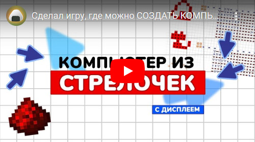

# Стрелочки
Коллекция карт, созданных в игре [«Стрелочки»](https://logic-arrows.io/) от [Onigiri](https://github.com/ArtemOnigiri).
 

Об игре от автора: 

   

## Карты

<table>
  <thead>
    <tr>
      <td width="50%">
        <h3><a href="computer-v2/README.md">Компьютер из стрелочек</a></h3>
        
      </td>
      <td>
        <h3><a href="computer-v1/README.md">Компьютер из стрелочек <i>(старый)<i></a></h3>
        
      </td>
    </tr>
    <tr>
    <tr>
      <td>
        <h3><a href="https://logic-arrows.io/map-life">Игра «Жизнь»</a></h3>
        
      </td>
      <td>
        <h3><a href="https://logic-arrows.io/map-matrix">Матрица</a></h3>
        
      </td>
    </tr>
    <tr>
      <td>
        <h3><a href="https://logic-arrows.io/map-matrix-rgb">Матрица цветная</a></h3>
        
      </td>
      <td>
        <h3><a href="https://logic-arrows.io/map-CcGrVgC8">Матрицы плотные</a></h3>
        
      </td>
    </tr>
    <tr>
      <td>
        <h3><a href="https://logic-arrows.io/map-fsG82aDy">RAM 32K</a></h3>
        
      </td>
      <td>
        <h3><a href="https://logic-arrows.io/map-ram256">RAM 256 v2</a></h3>
        
      </td>
    </tr>
    <tr>
      <td>
        <h3><a href="https://logic-arrows.io/map-utcKt1dM">RAM 256 v1</a></h3>
        
      </td>
      <td>
        <h3><a href="https://logic-arrows.io/map-ram64">RAM 64</a></h3>
        
      </td>
    </tr>
    <tr>
      <td>
        <h3><a href="https://logic-arrows.io/map-FI3Ue08n">ROM компактная</a></h3>
        
      </td>
      <td>
        <h3><a href="https://logic-arrows.io/map-0TNlFXRQa6Y">Конвертер BCD</a></h3>
        
      </td>
    </tr>
    <tr>
      <td>
        <h3><a href="https://logic-arrows.io/map-Xhj9Pead">Сегментные дисплеи</a></h3>
        
      </td>
      <td>
        <h3><a href="https://logic-arrows.io/map-kBhOopki">Прототип процессора</a></h3>
        
      </td>
    </tr>
    <tr>
      <td>
        <h3><a href="https://logic-arrows.io/map-Io2FESYk">Передатчики</a></h3>
        
      </td>
      <td>
        <h3><a href="https://logic-arrows.io/map-k_R4pB1A">Вентили</a></h3>
        
      </td>
    </tr>
    <tr>
      <td>
        <h3><a href="https://logic-arrows.io/map-lF-KRVo4vtw">Умножитель</a></h3>
        
      </td>
      <td>
        <h3><a href="https://logic-arrows.io/map-5bk8IiWhZ6Q">Сумматор</a></h3>
        
      </td>
    </tr>
    <tr>
      <td>
        <h3><a href="https://logic-arrows.io/map-GvPsAA38">Вычитатель</a></h3>
        
      </td>
      <td>
        <h3><a href="https://logic-arrows.io/map-um14l5Qr">Муравей</a></h3>
        
      </td>
    </tr>
  </thead>
</table>
