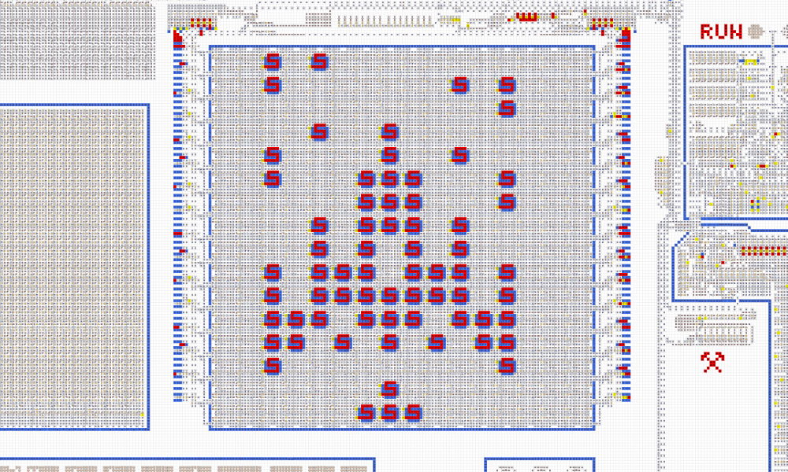
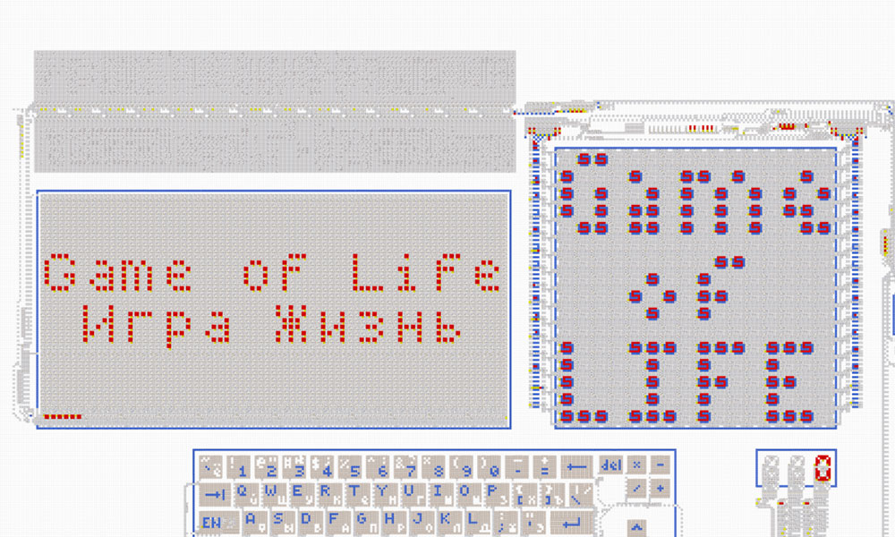

### [← Компьютер из стрелочек v2](computer.md)

# Примеры программ

<table>
  <thead>
    <tr>
      <td valign="top" width="50%">
        <h3><a href="computer-space-fight.asm">Игра «Space Fight!»</a></h3>
        <a href="computer-space-fight.asm"></a><br>
        Игра занимает 256 байт.<br>
        На дисплее внизу расположен корабль, а остальная область заполнена врагами. Нужно уничтожить 30 врагов за ограниченное число ходов. Периодически все враги приближаются к кораблю, причём с каждым разом это происходит всё чаще. Если кто-то из врагов долетит до корабля, игра проиграна. А в случае победы на экране отобразится приз.
      </td>
      <td valign="top">
        <h3><a href="computer-game-of-life.asm">Игра «Жизнь»</a></h3>
        <a href="computer-game-of-life.asm"></a><br>
        Игра занимает 512 байт.<br>
        В терминал выводится название игры, дисплей заполняется случайным наборов пикселей, а на цифровом индикаторе отображается счётчик кадров. Затем запускается бесконечный цикл вычислений, на обработку одного кадра уходит около часа.
      </td>
    </tr>
  </thead>
</table>
<br><br>

## Demo
```asm
            jmp title               ; Прыгаем через строку
text    db  "!иригинО\n,тевирП"     ; Строка "Привет,\nОнигири!" задом-наперёд

title:      ldi b, "\n"
            st b, 0x01              ; Дополняем строку
            ldi b, title -1
            ldi c, 0x3C             ; Порт терминала
            ldi d, loop

loop:       ld a, b
            st a, c
            dec b
            jnz d

            hlt

void1   db  0, 0, 0, 0, 0, 0, 0, 0, ; Заполняем пустыми байтами до адреса 0x3D
            0, 0, 0, 0, 0, 0, 0, 0,
            0, 0, 0, 0, 0, 0, 0, 0,
            0, 0, 0, 0, 0

in_out  db  0b_00000101             ; Порт вывода, подключён дисплей и терминал

void2   db  0

image   db  0b00000000, 0b00000000, ; Картинка для дисплея в области 0x40...0x5F
            0b00000000, 0b00000000,
            0b00000000, 0b00000000,
            0b00000010, 0b10000000,
            0b00111011, 0b10111000,
            0b00100101, 0b01001000,
            0b00100011, 0b10001000,
            0b00100001, 0b00001000,
            0b00010001, 0b00010000,
            0b00001101, 0b01100000,
            0b00010001, 0b00010000,
            0b00010011, 0b10010000,
            0b00001101, 0b01100000,
            0b00000000, 0b00000000,
            0b00000000, 0b00000000,
            0b00000000, 0b00000000
```
<br><br>

## Terminal
Выводит в терминал текст, набираемый на клавиатуре.
```asm
        inc a           ; 0b_00000001
        ldi b, 0x3E     ; Порт ввода/вывода
        st a, b         ; Подключаем терминал
        ldi c, 0x3C     ; Адрес вывода в терминал
        ldi d, loop     ; Адрес для повторения итерации

loop:   ld a, b         ; Читаем код нажатой клавиши
        st a, c         ; Отправляем в терминал
        jmp d           ; Повторяем итерацию
```
