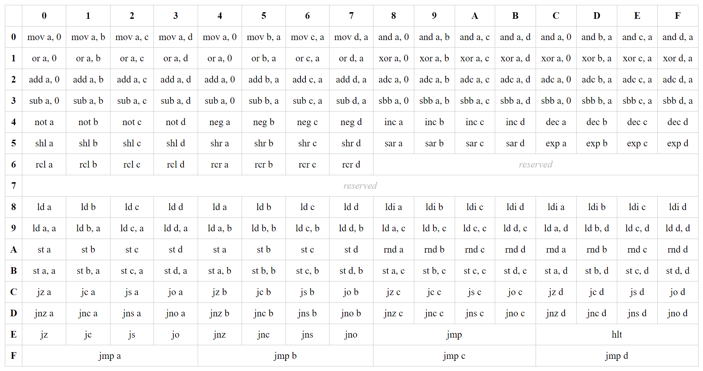

### [← Компьютер из стрелочек](./computer.md)

# Программирование

## Общие принципы
Для программирования используются команды ассемблера, которые располагаются в RAM и выполняются друг за другом, начиная с адреса `00`. Каждая команда занимает 1 байт. Некоторые команды требуют дополнительного аргумента, который также занимает 1 байт и располагается в RAM сразу вслед за командой. Команды работают с регистрами процессора `A` `B` `C` `D` и флагами `Z` `C` `S` `O`. Также, команды могут совершать переходы к различным участкам кода, создавая циклы, прыжки и пр. Регистры `A` `B` `C` `D` хранят по 1 байту каждый и имеют универсальное назначение. Флаги `Z` `C` `S` `O` выражают собой результат выполнения операций вычисления, а также могут влиять на ход других операций, в т. ч. быть условием для перехода к другому участку кода.

- **Флаг Z (ноль)** показывает, является ли результат вычисления нулём.
- **Флаг C (перенос)** показывает, был ли в результате вычисления выход одного из битов за пределы байта.
- **Флаг S (знак)** показывает состояние старшего бита у результата вычисления. В математике с отрицательным числами это означает, что результат меньше нуля.
- **Флаг O (переполнение)** показывает ситуацию, когда два операнда вычисления имеют одинаковый старший бит, а у результата старший бит имеет противоположное значение. В математике с отрицательными числами это означает, что результат вышел за допустимый диапазон и считается ошибочным.
  

## Команды ассемблера

Это сводная таблица всех команд ассемблера, где каждая команда имеет свой уникальный HEX-код. К примеру, команда `st a, b` имеет код `B4` (ряд, затем колонка). Ниже идёт описание каждой команды. 
  

### Команды вычисления
Команды из этого набора читают информацию из одного или двух регистров, производят вычисление и сохраняют результат в один из этих же регистров. Также, в зависимости от типа операции, они могут воздействовать на те или иные флаги. В названиях команд используются условные обозначения ***X*** и ***Y***, которые означают любой из регистров `A` `B` `C` `D`, в зависимости от конкретной команды из сводной таблицы (выше).

Команда|Описание|На какие флаги воздействует
---|---|---
mov ***X***, ***Y*** |Копирует из ***Y*** в ***X***. Если в качестве ***Y*** указан 0, то в ***X*** записывает ноль.|не воздействует
and ***X***, ***Y*** |Побитовое И между ***X*** и ***Y***, результат сохраняет в ***X***. Если в качестве ***Y*** указан 0, то ничего не сохраняет, а лишь воздействует на флаги.|Z и S
or ***X***, ***Y*** |Побитовое ИЛИ между ***X*** и ***Y***, результат сохраняет в ***X***. Если в качестве ***Y*** указан 0, то ничего не сохраняет, а лишь воздействует на флаги.|Z и S
xor ***X***, ***Y*** |Побитовое исключающее ИЛИ между ***X*** и ***Y***, результат сохраняет в ***X***. Если в качестве ***Y*** указан 0, то ничего не сохраняет, а лишь воздействует на флаги.|Z и S
add ***X***, ***Y*** |Складывает ***X*** и ***Y***, результат сохраняет в ***X***. Если в качестве ***Y*** указан 0, то ничего не сохраняет, а лишь воздействует на флаги.|все флаги
adc ***X***, ***Y*** |То же, что и предыдущее, но если ранее был установлен флаг `C`, к результату дополнительно прибавляется 1.|все флаги
sub ***X***, ***Y*** |Из ***X*** вычитает ***Y***, результат сохраняет в ***X***. Если в качестве ***Y*** указан 0, то ничего не сохраняет, а лишь воздействует на флаги.|все флаги
sbb ***X***, ***Y*** |То же, что и предыдущее, но если ранее был установлен флаг `C`, из результата дополнительно вычитается 1.|все флаги
not ***X*** |Заменяет каждый бит на противоположный.|Z и S
neg ***X*** |Меняет знак у числа. (Число необходимо воспринимать как знаковое.)|Z и S
inc ***X*** |Прибавляет 1.|Z и S
dec ***X*** |Отнимает 1.|Z и S
shl ***X*** |Сдвигает все биты на один влево. Левый бит переходит во флаг `С`. Правый бит становится нулём.|Z, C и S
shr ***X*** |Сдвигает все биты на один вправо. Левый бит становится нулём. Правый бит переходит во флаг `С`.|Z, C и S
sar ***X*** |То же, что и предыдущее, но левый бит не меняет своего значения.|Z, C и S
exp ***X*** |Копирует флаг `С` в каждый бит числа.|Z и S
rcl ***X*** |Сдвигает все биты на один влево. Правый бит переходит из флага `С`. Левый бит переходит во флаг `С`.|Z, C и S
rcr ***X*** |Сдвигает все биты на один вправо. Левый бит переходит из флага `С`. Правый бит переходит во флаг `С`.|Z, C и S

 

### Команды управления
Команды из этого набора отвечают за операции ввода/вывода и переходы. Воздействия на флаги здесь не происходит, однако флаги могут использоваться в качестве условия. В названиях команд используются условные обозначения ***X*** и ***Y***, которые означают любой из регистров `A` `B` `C` `D`, а также ***F***, которое означает любой из флагов `Z` `C` `S` `O`, в зависимости от конкретной команды из сводной таблицы (выше).

Команда|Описание
---|---
ld ***X*** |Берёт из RAM следующий байт в качестве адреса для чтения из RAM в регистр ***X***.
ld ***X***, ***Y*** |Берёт из регистра ***Y*** байт в качестве адреса для чтения из RAM в регистр ***X***.
ldi ***X*** |Читает из RAM следующий байт непосредственно в регистр ***X***.
st ***X*** |Берёт из RAM следующий байт в качестве адреса для записи в RAM из регистра ***X***.
st ***X***, ***Y*** |Берёт из регистра ***Y*** байт в качестве адреса для записи из RAM из регистра ***X***.
rnd ***X*** |Генерирует случайный байт и кладёт в регистр ***X***.
jmp|Берёт из RAM следующий байт в качестве адреса и переходит по нему.
jmp ***X*** |Берёт из регистра ***X*** байт в качестве адреса и переходит по нему.
j***F*** |Берёт из RAM следующий байт в качестве адреса и переходит по нему, при условии что флаг ***F*** в состоянии 1.
jn***F*** |Берёт из RAM следующий байт в качестве адреса и переходит по нему, при условии что флаг ***F*** в состоянии 0.
j***F*** ***X*** |Берёт из регистра ***X*** байт в качестве адреса и переходит по нему, при условии что флаг ***F*** в состоянии 1.
jn***F*** ***X*** |Берёт из регистра ***X*** байт в качестве адреса и переходит по нему, при условии что флаг ***F*** в состоянии 0.
hlt|Останавливает выполнение программы.
