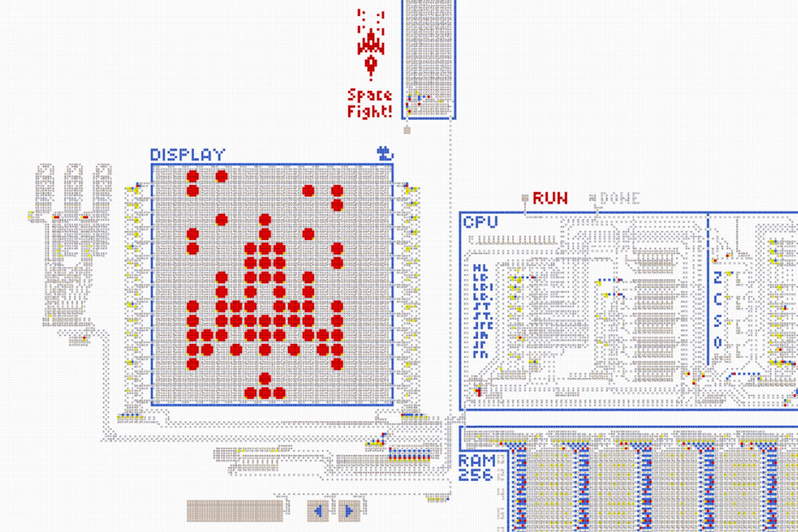
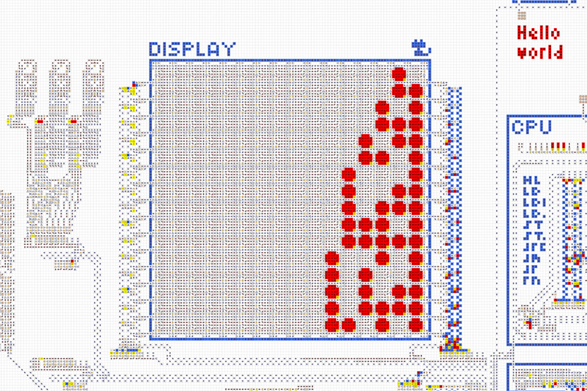
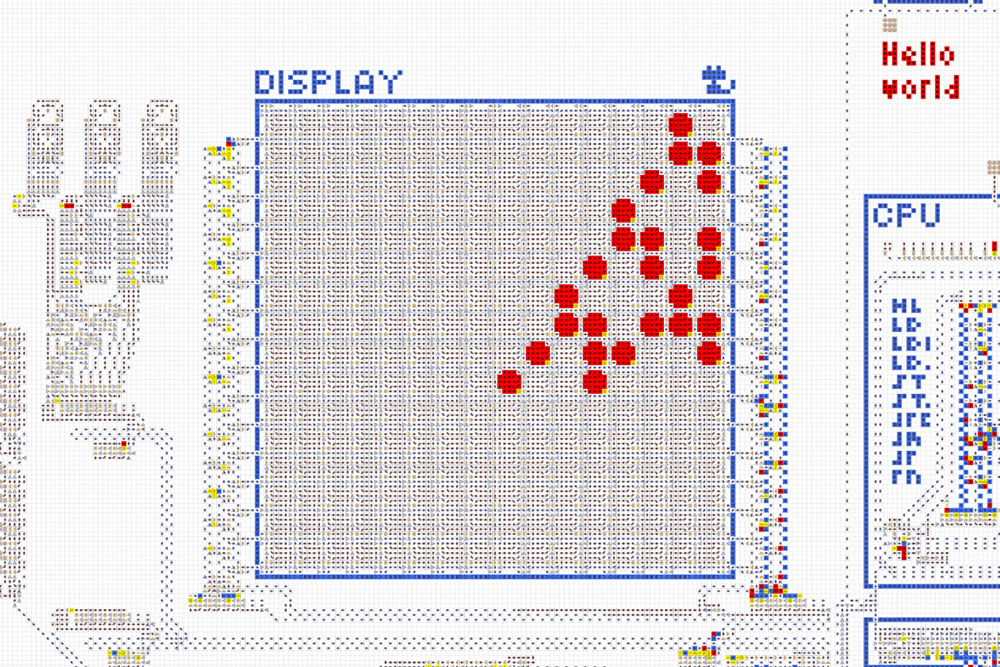
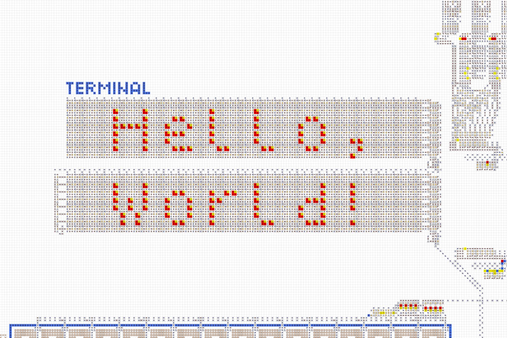

### [← В начало](../README.md)

# Компьютер из стрелочек *(старый)*
*(См. новый **[Компьютер из стрелочек](../computer-v2/README.md)**.)*
   

<table>
  <thead>
    <tr>
      <td valign="top" width="50%">
        Полноценный компьютер, целиком сделанный из стрелочек. Позволяет создавать и запускать различные программы и игры.  
        <a href="https://logic-arrows.io/map-lVeJ9jtX">На карту с компьютером →</a>  
        <a href="specification.md">Характеристики и устройство</a>  
        <a href="programming.md">Программирование</a>  
        <a href="#examples">Готовые программы</a>
      </td>
      <td valign="top">
        
      </td>
    </tr>
  </thead>
</table>

## Демонстрация работы
Зайдите на **[карту с компьютером](https://logic-arrows.io/map-lVeJ9jtX).** В ползунке внизу справа установите максимальную скорость. Нажмите на кнопку, подписанную `Hello world`, чтобы загрузить соответствующую программу с дискеты в оперативную память. Дождитесь окончания загрузки. Далее нажмите на кнопку `RUN` и наблюдайте выполнение программы, в процессе которого на пиксельном дисплее слева постепенно выведется надпись «Hello world» и котик. По окончании выполнения программы загорится лампочка `DONE`.
    

## Готовые программы

### Space Fight!
На экране внизу располагается твой корабль, а остальная область заполнена врагами. Нужно уничтожить 30 врагов за ограниченное число ходов. Периодически все враги перемещаются к тебе, причём с каждым разом это происходит всё чаще. Если кто-то из врагов долетит до тебя — ты проиграл. А в случае победы ты получить главный галактический приз!

[Перейти на карту](https://logic-arrows.io/map-space-fight) &nbsp;|&nbsp; [Исходный код игры](asm/space-fight.asm)

  

<table>
  <thead>
    <tr>
      <td valign="top" width="50%">
        <h3><a href="asm/hello-world.asm">Hello World</a></h3>
         
        Выводит на пиксельный дисплей котика и надпись «Hello world».
      </td>
      <td valign="top">
        <h3><a href="asm/prime-numbers.asm">Prime Numbers</a></h3>
         
        Находит первые 16 простых чисел и выводит их на пиксельный дисплей в двоичном формате. Выполнение занимает 3691 операцию.
      </td>
    </tr>
    <tr>
      <td valign="top">
        <h3><a href="asm/fibonacci-numbers.asm">Fibonacci Numbers</a></h3>
         
        Находит первые 10 чисел Фибоначчи и выводит их на пиксельный дисплей в двоичном формате.
      </td>
      <td valign="top">
        <h3><a href="asm/typewriter.asm">Typewriter</a></h3>
         
        Выводит в терминал текст, набираемый на клавиатуре.
      </td>
    </tr>
  </thead>
</table>
