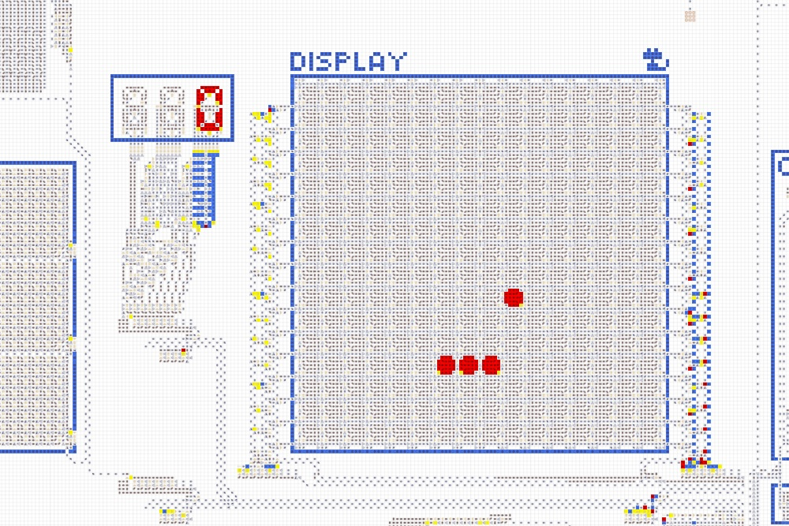
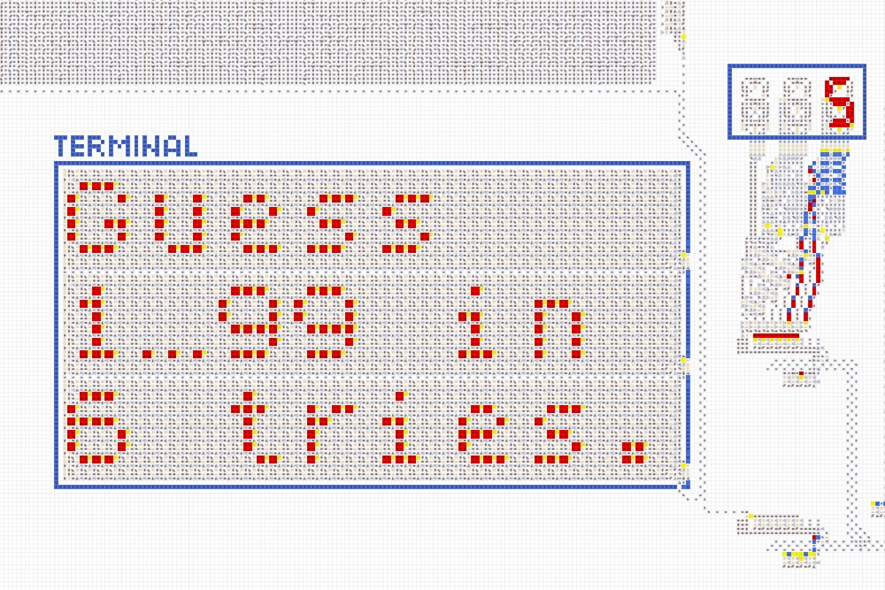

# Computer v1
🌐 English | [Русский](../ru/computer-v1/README.md)
  

<table>
  <thead>
    <tr>
      <td valign="top" width="50%">
        A full-fledged computer assembled entirely of logic arrows: an 8-bit processor, 256 bytes
        of memory, a keyboard, a display, a terminal, a digital indicator, and a set of diskettes
        with programs and games. The predecessor of
        <a href="../computer-v2/README.md">Computer v2</a>.
          
        <ul>
          <li><a href="https://logic-arrows.io/map-lVeJ9jtX"><b>Map with the computer ⇾</b></a></li>
        </ul>
        <ul>
          <li><a href="specification.md">Structure and Specifications</a></li>
          <li><a href="programming.md">Programming</a></li>
          <li><a href="#examples">Ready-made programs</a></li>
          <li><a href="#links">Links</a></li>
        </ul>
      </td>
      <td valign="top">
        
      </td>
    </tr>
  </thead>
</table>
 

## Demonstration
Go to the [map with the computer](https://logic-arrows.io/map-lVeJ9jtX). On the bottom slider, set
the maximum speed. Press the `Hello world` button and wait for the program to load into the
computer’s memory. Next, press the `RUN` button and watch as the program displays a cat and the text
“Hello world”. When finished, the `DONE` light will turn on.

To run your own program on the computer, see [Programming](programming.md).
   

## Ready-made programs
<table>
  <thead>
    <tr>
      <td valign="top" width="33%">
        <a href="asm/space-fight.asm">
           
          <b>Space Fight Game</b>
        </a> 
        Enemy ships are approaching you, which you need to shoot down within a limited time. If you
        win, you will receive a prize.  
        The game occupies the entire available memory of 256 bytes and for performance purposes is
        available on a <a href="https://logic-arrows.io/map-space-fight">separate map</a>.  
      </td>
      <td valign="top" width="33%">
        <a href="asm/hello-world.asm">
           
          <b>Hello World</b>
        </a> 
        Displays a cat and the text “Hello world” on the screen  
      </td>
      <td valign="top" width="33%">
        <a href="https://github.com/mihail-moseev/program_for_computer_in_logic-arrows/blob/main/code%20tennis%20v1.asm">
           
          <b>Tennis Game</b>
        </a> 
        Bounce the ball with the paddle, don’t let it fall, and score points. Author:
        <a href="https://github.com/mihail-moseev/program_for_computer_in_logic-arrows">
        Mikhail Moseev</a>.  
      </td>
    </tr>
    <tr>
      <td valign="top">
        <a href="https://github.com/mihail-moseev/program_for_computer_in_logic-arrows/blob/main/code%20Langton%27s%20ant.asm">
           
          <b>Langton's Ant</b>
        </a> 
        The ant crawls across the display, repainting the cells and turning by a simple rule that
        produces a complex pattern. Author:
        <a href="https://github.com/mihail-moseev/program_for_computer_in_logic-arrows">
        Mikhail Moseev</a>.  
      </td>
      <td valign="top">
        <a href="https://github.com/mihail-moseev/program_for_computer_in_logic-arrows/blob/main/code%20GMN.asm">
           
          <b>Guess the Number Game</b>
        </a> 
        Guess the numbers using the “higher/lower” rule without losing five lives. Author:
        <a href="https://github.com/mihail-moseev/program_for_computer_in_logic-arrows">
        Mikhail Moseev</a>.  
      </td>
      <td valign="top">
        <a href="asm/prime-numbers.asm">
           
          <b>Prime Numbers</b>
        </a> 
        Finds the first 16 prime numbers and displays them on the screen in binary format  
      </td>
    </tr>
    <tr>
      <td valign="top">
        <a href="asm/fibonacci-sequence.asm">
           
          <b>Fibonacci Sequence</b>
        </a> 
        Finds 10 Fibonacci numbers and displays them on the screen in binary format  
      </td>
      <td valign="top">
        <a href="asm/typewriter.asm">
           
          <b>Typewriter</b>
        </a> 
        Outputs text typed on the keyboard to the terminal  
      </td>
      <td valign="top">
        <a href="asm/font-test.asm">
           
          <b>Font Test</b>
        </a> 
        Outputs all possible characters to the terminal (encoding
        <a href="https://en.wikipedia.org/wiki/Windows-1251">cp1251</a>)  
      </td>
    </tr>
  </thead>
</table>
 

## Links

- [Online compiler](https://chubrik.github.io/arrows-compiler/#cpu=v1) – write a program and get
  a diskette to paste into the game
- [GraphDLC](https://github.com/MerinPrime/GraphDLC) – essential browser extension that speeds up
  Logic Arrows by 5000 times
- [Programs by Mikhail Moseev](https://github.com/mihail-moseev/program_for_computer_in_logic-arrows)
  – repository by the author of several programs for both computers
- [Discord server](https://discord.gg/8FMuQuMFCN) and [Telegram channel](https://t.me/logic_arrows)
  – where people discuss the computers and share ideas and new programs
- [Computer v2](../computer-v2/README.md) – improved version of the computer with a larger set of
  programs and games, including some by community members
- [My Computer on Logic Chips](https://habr.com/ru/articles/590821/) – a series of articles on
  Habr (in Russian) about the physical prototype that Computer v1 was modeled on
