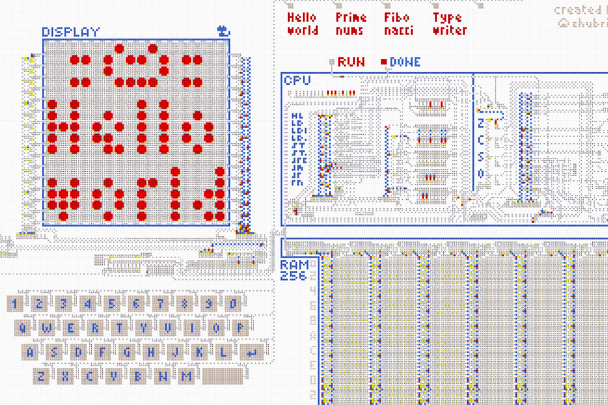

# Компьютер из стрелочек *Gen. 1*

> [!TIP]
> См. новый [Компьютер из стрелочек ***Gen. 2***](../computer-v2/README.md).

 

<table>
  <thead>
    <tr>
      <td valign="top" width="50%">
        Полноценный компьютер, целиком сделанный из стрелочек. Позволяет создавать и запускать
        различные программы и игры.  
        <a href="https://logic-arrows.io/map-lVeJ9jtX"><b>Карта с компьютером</b></a>  
        <a href="specification.md">Устройство и характеристики</a>  
        <a href="programming.md">Программирование</a>  
        <a href="#examples">Готовые программы</a>
      </td>
      <td valign="top">
        
      </td>
    </tr>
  </thead>
</table>
  

## Демонстрация работы
Зайдите на [карту с компьютером](https://logic-arrows.io/map-lVeJ9jtX). В нижнем ползунке установите
максимальную скорость. Нажмите на кнопку `Hello world` и дождитесь загрузки программы в память
компьютера. Далее нажмите на кнопку `RUN` и наблюдайте, как программа выведет на дисплей котика и
надпись «Hello world». По окончании загорится лампочка `DONE`. Чтобы запустить на компьютере вашу
собственную программу, см. [Программирование](programming.md).
   

## Готовые программы

### Space Fight!
Внизу дисплея расположен корабль, а остальная область заполнена врагами. Нужно сбить 30 врагов за
ограниченное время. Враги приближаются к кораблю с нарастающей скоростью, и, если враг достигнет
корабля, игра проиграна. В случае победы на дисплее появится приз.

[Перейти на карту](https://logic-arrows.io/map-space-fight) &nbsp;|&nbsp;
[Исходный код игры](asm/space-fight.asm)

  

<table>
  <thead>
    <tr>
      <td valign="top" width="50%">
        <h3><a href="asm/hello-world.asm">Hello World</a></h3>
         
        Выводит на дисплей котика и надпись «Hello world».
      </td>
      <td valign="top">
        <h3><a href="asm/prime-numbers.asm">Prime Numbers</a></h3>
         
        Находит первые 16 простых чисел и выводит их на дисплей в двоичном формате. Выполнение
        занимает 3691 операцию.
      </td>
    </tr>
    <tr>
      <td valign="top">
        <h3><a href="asm/fibonacci-sequence.asm">Fibonacci Sequence</a></h3>
         
        Находит 10 чисел Фибоначчи и выводит их на дисплей в двоичном формате.
      </td>
      <td valign="top">
        <h3><a href="asm/typewriter.asm">Typewriter</a></h3>
         
        Выводит в терминал текст, набираемый на клавиатуре.
      </td>
    </tr>
  </thead>
</table>
