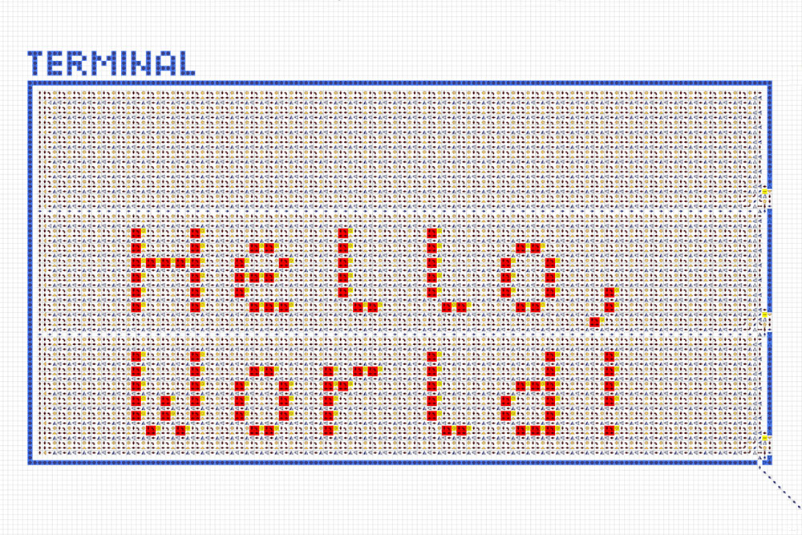

# Computer v1

> [!TIP]
> See the new [Computer v2](../computer-v2/README.md).

 

<table>
  <thead>
    <tr>
      <td valign="top" width="50%">
        A full-fledged computer made entirely of logic arrows. It allows you to create and run
        various programs and games.  
        <a href="https://logic-arrows.io/map-lVeJ9jtX"><b>Map with the computer</b></a>  
        <a href="specification.md">Structure and Specifications</a>  
        <a href="programming.md">Programming</a>  
        <a href="#examples">Ready-made programs</a>
      </td>
      <td valign="top">
        
      </td>
    </tr>
  </thead>
</table>
 

## Demonstration
Go to the [map with the computer](https://logic-arrows.io/map-lVeJ9jtX). On the bottom slider, set
the maximum speed. Press the `Hello world` button and wait for the program to load into the
computer’s memory. Next, press the `RUN` button and watch as the program displays a cat and the text
“Hello world”. When finished, the `DONE` light will turn on.

To run your own program on the computer, see [Programming](programming.md).
   

## Ready-made programs
<table>
  <thead>
    <tr>
      <td valign="top" width="50%">
        <h3><a href="asm/space-fight.asm">Space Fight Game</a></h3>
         
        Enemy ships are approaching you, which you need to shoot down within a limited time. If you
        win, you will receive a prize.  
        The game occupies the entire available memory of 256 bytes and for performance purposes is
        available on a <a href="https://logic-arrows.io/map-space-fight">separate map</a>.
      </td>
      <td valign="top">
        <h3><a href="asm/hello-world.asm">Hello World</a></h3>
         
        Displays a cat and the text “Hello world” on the screen
      </td>
    </tr>
    <tr>
      <td valign="top">
        <h3><a href="asm/prime-numbers.asm">Prime Numbers</a></h3>
         
        Finds the first 16 prime numbers and displays them on the screen in binary format
      </td>
      <td valign="top">
        <h3><a href="asm/fibonacci-sequence.asm">Fibonacci Sequence</a></h3>
         
        Finds 10 Fibonacci numbers and displays them on the screen in binary format
      </td>
    </tr>
    <tr>
      <td valign="top">
        <h3><a href="asm/typewriter.asm">Typewriter</a></h3>
         
        Outputs text typed on the keyboard to the terminal
      </td>
      <td valign="top">
        <h3><a href="asm/font-test.asm">Font Test</a></h3>
         
        Outputs all possible characters to the terminal (encoding
        <a href="https://en.wikipedia.org/wiki/Windows-1251">cp1251</a>)
      </td>
    </tr>
  </thead>
</table>
