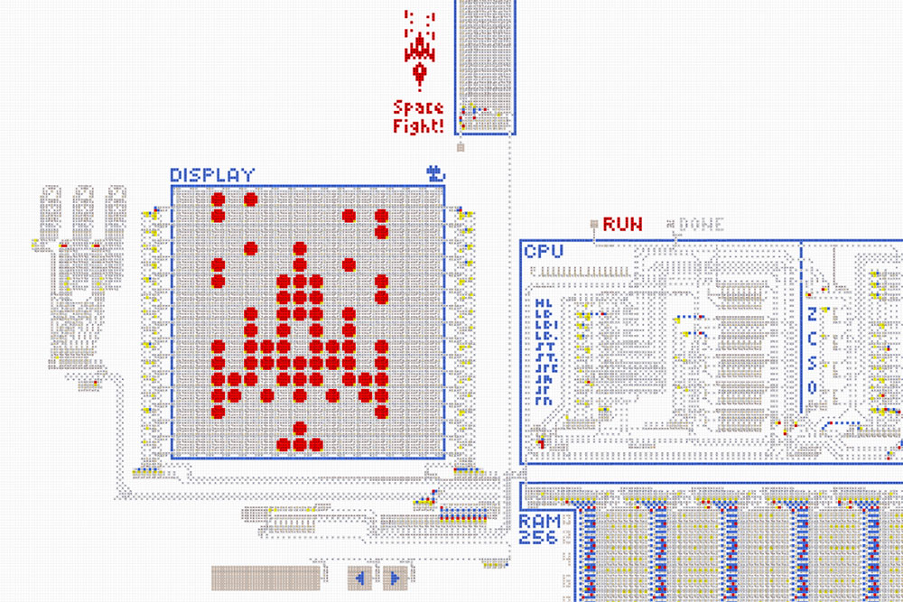

### [← Компьютер из стрелочек v1](index.md)

# Примеры готовых программ

## Space Fight!
На экране внизу располагается твой корабль, а остальная область заполнена врагами. Нужно уничтожить 30 врагов за ограниченное число ходов. Периодически все враги перемещаются к тебе, причём с каждым разом это происходит всё чаще. Если кто-то из врагов долетит до тебя — ты проиграл. А в случае победы ты получить главный галактический приз!

[Перейти на карту](https://logic-arrows.io/map-space-fight) &nbsp;|&nbsp; [Исходный код игры](space-fight.asm)

[](https://logic-arrows.io/map-space-fight)
<br><br>

## Hello world
Выводит на пиксельный дисплей котика и надпись «Hello world».
```asm
ldi a, 0x80         ; выбираем режим для вывода
st a, 0x3F          ; подключаем дисплей
ldi b, imagesize    ; счётчик, по которому программа завершится
ldi c, image        ; указатель на начало картинки в памяти
ldi d, 0x40         ; указатель на начало области дисплея
loop:               ; цикл копирования картинки на дисплей
    ld a, c             ; читаем один байт картинки
    st a, d             ; выводим байт картинки на дисплей
    inc c               ; смещаем указатель на картинку
    inc d               ; смещаем указатель на дисплей
    dec b               ; уменьшаем счётчика
    jnz loop            ; если счётчик не ноль, делаем новую итерацию
hlt                 ; завершаем программу

void db 0, 0, 0, 0, 0, 0         ; выравнивание (необязательно)

image db 0b00000010, 0b01000000, ; картинка
         0b00110101, 0b10101100,
         0b00000100, 0b00100000,
         0b00110011, 0b11001100,
         0b00000000, 0b00000000,
         0b10100000, 0b10100000,
         0b10100100, 0b10100100,
         0b11101010, 0b10101010,
         0b10101100, 0b10101010,
         0b10100110, 0b10100100,
         0b00000000, 0b00000000,
         0b00000000, 0b00010001,
         0b10100100, 0b11010001,
         0b11101010, 0b10010011,
         0b11101010, 0b10010101,
         0b01000100, 0b10010011
imagesize equ $ - image          ; размер картинки
```
<br><br>

## Поиск простых чисел
Находит первые 16 простых чисел и выводит их на пиксельный дисплей в двоичном формате. Выполнение занимает 3691 операцию.
```asm
ldi a, 0x80     ; выбираем режим для вывода
st a, 0x3F      ; подключаем дисплей
ldi b, 0x02     ; первое простое число 2
ldi d, 0x41     ; адрес на дисплее для первого числа
st b, d         ; выводим число на дисплей
inc b           ; второе простое число 3
inc d           ; дважды смещаем указатель на дисплей, чтобы перейти на следующий ряд
inc d
st b, d         ; выводим число на дисплей
next:           ; цикл подбора кандидатов на простые числа
  inc b             ; дважды увеличиваем число-кандидат – идём только по нечётным числам
  inc b
  ldi d, 0x41       ; устанавливаем указатель на первое простое число на дисплее
test:           ; цикл подбора множителей среди уже найденных простых чисел
  inc d             ; смещаем указатель на следующее простое число на дисплее
  inc d
  ld c, d           ; берём простое число с дисплея в качестве множителя
  mov a, b          ; копируем число-кандидат
  shr a             ; делим его на 2
  sub a, c          ; вычитаем из него текущий множитель
  js prime          ; если множитель больше половины числа-кандидата, то результат будет меньше нуля,
                    ;   и значит дальше подбирать множители нет смысла — мы уже нашли новое простое число
  mov a, b          ; копируем число-кандидат
loop:           ; цикл вычитания множителя из числа-кандидата
  sub a, c          ; вычитание
  jz next           ; если результат равен нулю, значит число не простое, переходим к следующему кандидату
  jns loop          ; если результат больше нуля, продолжаем вычитать
jmp test        ; если результат меньше нуля, переходим к следующему множителю
prime:          ; работа с найденным простым числом
  ld d, last        ; читает указатель на последнее найденное простое число на дисплее
  inc d             ; дважды смещаем указатель
  inc d
  st d, last        ; сохраняем указатель
  st b, d           ; сохраняем по указателю на дисплей новое простое число
  ldi a, 0x5F       ; берём указатель на последнее возможное место в нижнем ряду дисплея
  xor a, d          ; сравниваем два указателя
  jnz next          ; если они не равны, переходим к рассмотрению следующего числа-кандидата
hlt             ; завершаем программу
last db 0x43    ; указатель на последнее найденное простое число на дисплее
```
<br><br>

## Числа Фибоначчи
Находит первые 10 чисел Фибоначчи.
```asm
ldi a, 0x80
st a, 0x3F
inc b
inc c
ldi d, 0x3F
loop:
  inc d
  inc d
  mov a, b
  add a, c
  mov b, a
  st a, d
  inc d
  inc d
  mov a, c
  add a, b
  mov c, a
  st a, d
  ldi a, 0x53
  xor a, d
  jnz loop
hlt
```
<br><br>

## Печатная машинка
Выводит в терминал текст, набираемый на клавиатуре.
```asm
ldi c, 0x40
st c, 0x3F
ldi b, 0x3E
ldi d, loop
loop:
  ld a, b
  st a, c
  st d, b
  jmp d
```
