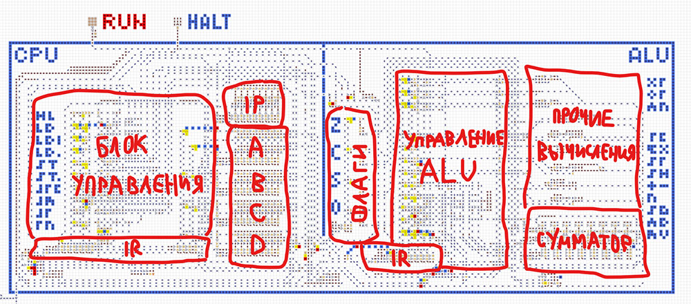
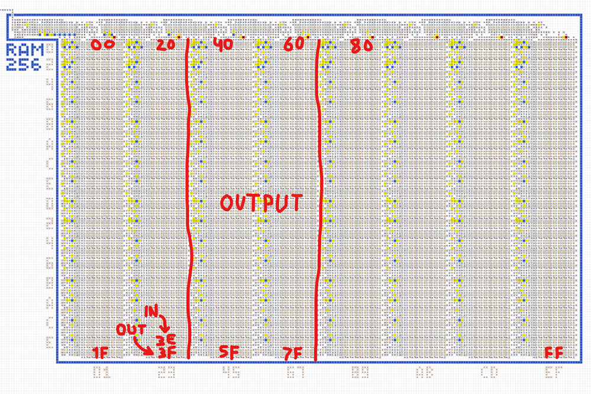
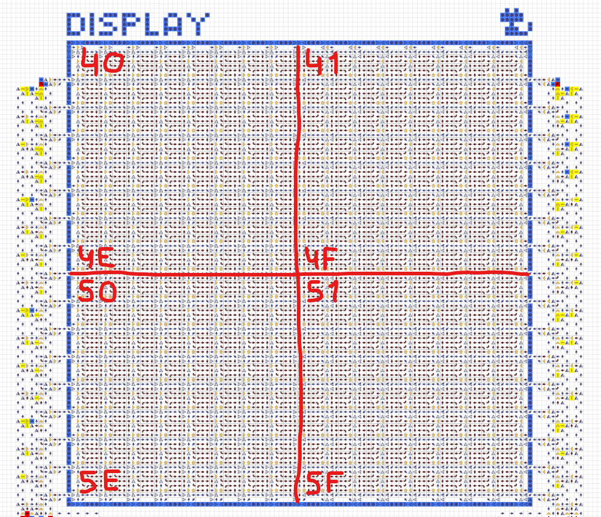
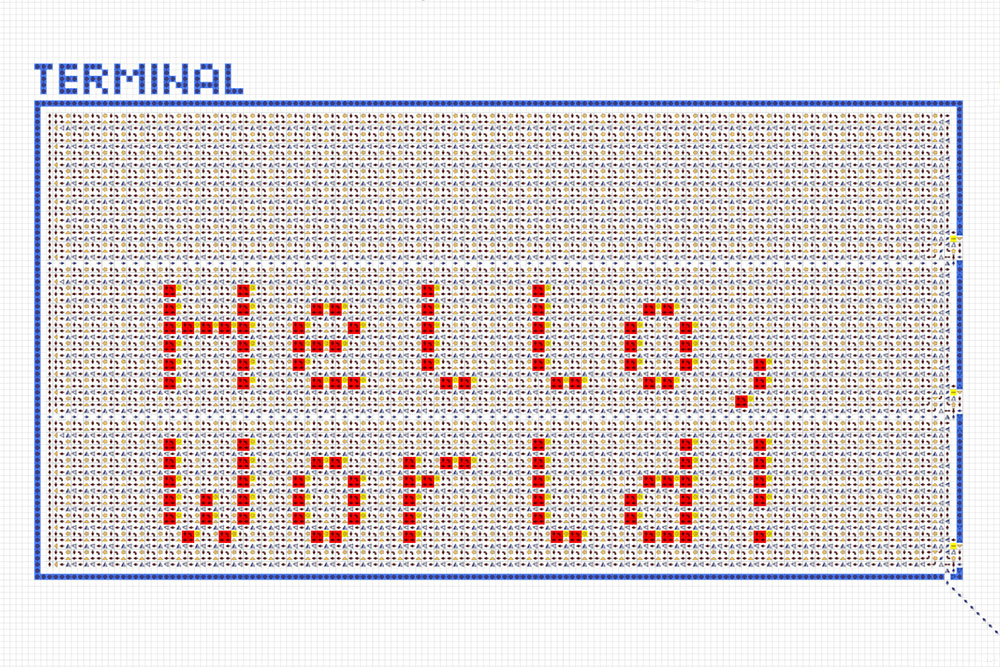

# Устройство и характеристики
Компьютер состоит из процессора, оперативной памяти, устройств ввода/вывода и набора программ.
Основные характеристики:
- 8-битная архитектура, процессор с 4 регистрами и флагами.
- Оперативная память 256 байт с интегрированной видеопамятью и портами.
- Ввод/вывод: клавиатура, монохромный дисплей, терминал и цифровой индикатор.
- Собственный язык ассемблера (см. [Программирование](programming.md)).
- Загрузка программ со специальных дискет.
   

## Процессор
Процессор состоит из двух частей: управляющей и вычислительной (ALU). Управляющая часть состоит из
указателя операции `IP`, регистра операции `IR`, блока управления и 4 свободных регистров `A` `B`
`C` `D`. Вычислительная часть состоит из регистра операции `IR`, 4 флагов `Z` `C` `S` `O`, блока
управления, многофункционального сумматора и ряда других мелких механизмов.

Процессор читает команду из RAM по адресу, лежащему в `IP`. Команда попадает в `IR`, инициируя
выполнение той или иной операции. Во время выполнения операции происходит взаимодействие с
регистрами и флагами. После этого `IP` инкрементируется и процесс повторяется. Подробнее см.
[Программирование](programming.md).

  

## Оперативная память
Памятью компьютера является RAM объёмом 256 байт. Единицей хранимой информации является 1 байт,
адрес доступа к памяти также представляет собой 1 байт.

Адрес `3E` подключён к системе ввода. По этому адресу всегда можно прочитать, например, о нажатой
клавише на клавиатуре.

Адрес `3F` подключён к управлению выводом. К примеру, если записать по этому адресу байт `80`, то
вывод переключится на дисплей.

Адреса `40...7F` являются совмещённой видеопамятью. Запись по этим адресам может параллельно
воздействовать на текущее средство вывода, в зависимости от его типа.

  

## Клавиатура
После нажатия на любую клавишу, её код может быть прочитан процессором из порта `3E`. Для
определения повторных нажатий программе следует самостоятельно сбрасывать значение в порту. Коды
символов соответствуют кодировке [`cp1251`](https://ru.wikipedia.org/wiki/Windows-1251). Клавишам
`←` `↑` `→` `↓` `Enter` соответствуют коды `11` `12` `13` `14` `0A`.
   

## Дисплей
Для переключения вывода на дисплей необходимо в порт `3F` записать байт `80`. Ниже показано
соответствие адресов различным участкам дисплея. Запись по этим адресам будет приводить к появлению
на дисплее пикселей, соответствующих записанным битам.

  

## Терминал
Для переключения вывода на терминал необходимо в порт `3F` записать байт `40`. Далее, каждый байт,
записанный по адресу `40`, будет выводиться на терминал в виде символа в кодировке
[cp1251](https://ru.wikipedia.org/wiki/Windows-1251), сдвигая все предыдущие символы влево и далее
на строчку выше.

  

## Цифровой индикатор
Состоит из 3 десятичных цифр и отображает числа в диапазоне `0...255`. Для переключения вывода на
цифровой индикатор необходимо в порт `3F` записать байт `10`. Далее, каждый байт, записанный по
адресу `40`, будет преобразован в десятичный формат и отображён на цифровом индикаторе.
