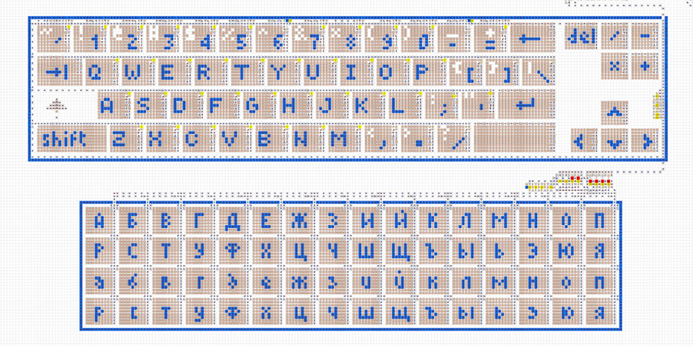

# Structure and Specifications
 

The computer consists of a processor, RAM, input/output devices, and a set of programs.
Main characteristics:
- 8-bit architecture, processor with 4 registers and flags.
- 256 bytes of RAM with integrated video memory and ports.
- Input/output: keyboard, display, terminal, and digital indicator.
- Own assembly language (see [Programming](programming.md)).
- Loading programs from special disks.
   

## Processor
The processor consists of two parts: a control unit and an arithmetic logic unit (ALU). The control
unit consists of an instruction pointer `IP`, an instruction register `IR`, a control block, and
free registers `A` `B` `C` `D`. The arithmetic logic unit consists of the instruction register `IR`,
flags `Z` `C` `S` `O` a control block, a multifunctional adder, and other small mechanisms.

The processor reads an instruction from RAM at the address stored in `IP`. The instruction goes into
`IR`, initiating the execution of a particular operation. During the operation, there is interaction
with registers and flags. After that, `IP` is incremented and the process repeats. For more details,
see [Programming](programming.md).

  

## RAM
The computer’s memory is 256 bytes of RAM. The unit of stored information is 1 byte, and the memory
access address is also 1 byte.

Input port `3E` is connected to the keyboard. Output port `3F` allows switching between different
output devices. The address range `40...7F` is shared video memory.

  

## Keyboard
After entering any character, its code can be read by the program from port `3E`. To detect repeated
input, the program should reset the value in the port itself. The character codes correspond to the
[`cp1251`](https://en.wikipedia.org/wiki/Windows-1251) encoding. The keys `←` `↑` `→` `↓` `Enter`
correspond to the codes `11` `12` `13` `14` `0A`.

  

## Display
To switch the output to the display, you need to write the byte `80` to port `3F`. Below is a
correspondence of addresses to different parts of the display. Sending data to these addresses
results in the appearance of corresponding pixels on the display.

  

## Terminal
To switch the output to the terminal, you need to write the byte `40` to port `3F`. Then, each byte
sent to address `40` is output to the terminal as a character in the
[`cp1251`](https://en.wikipedia.org/wiki/Windows-1251) encoding, shifting all previous characters to
the left and then up a line.

  

## Digital Indicator
It consists of 3 decimal digits and displays numbers in the range `0...255`. To switch the output to
the digital indicator, you need to write the byte `10` to port `3F`. Then, each byte sent to address
`40` is converted to decimal format and displayed on the digital indicator.

