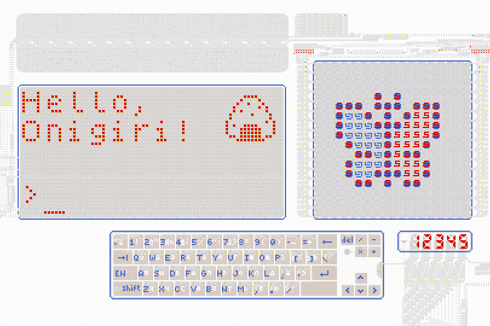
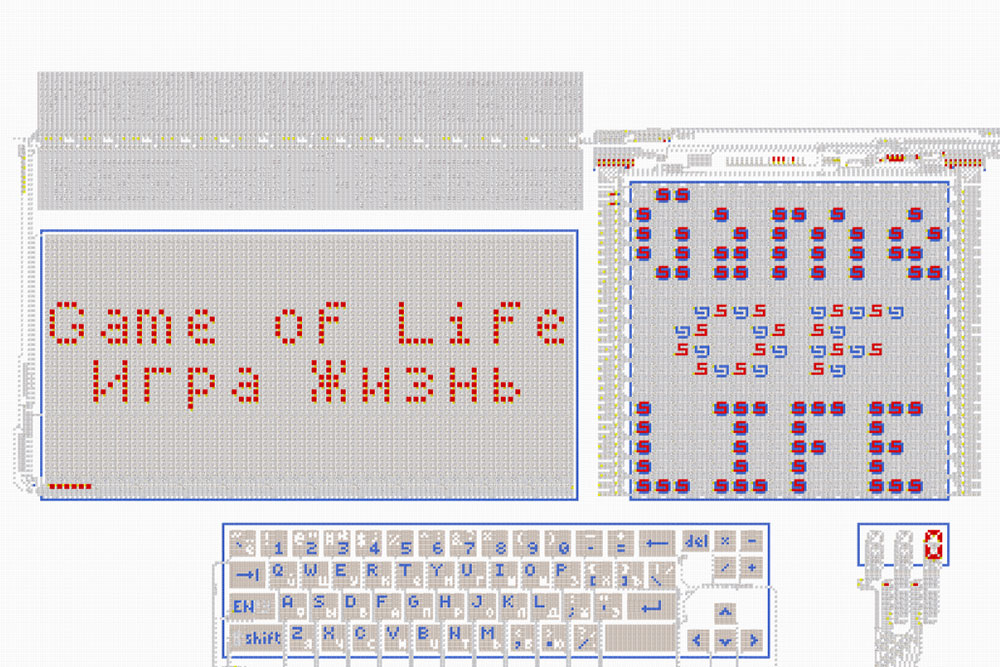
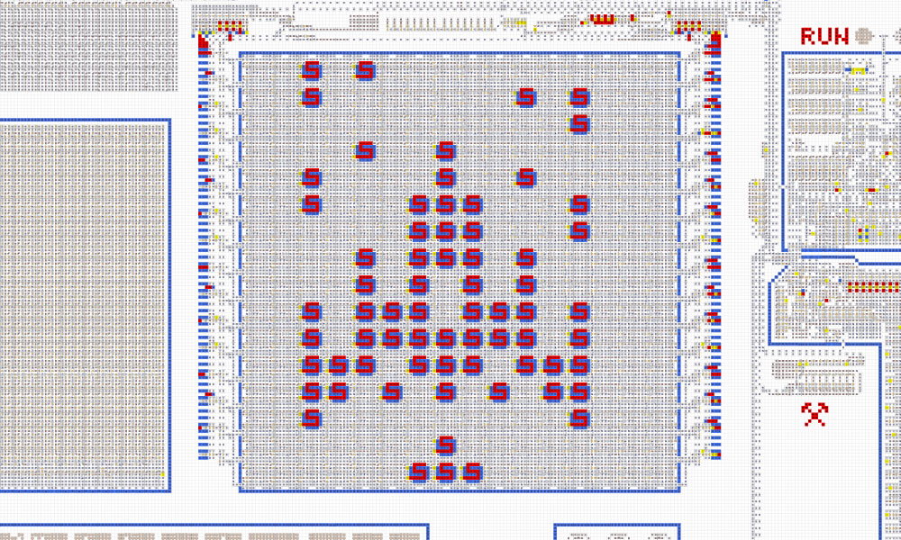
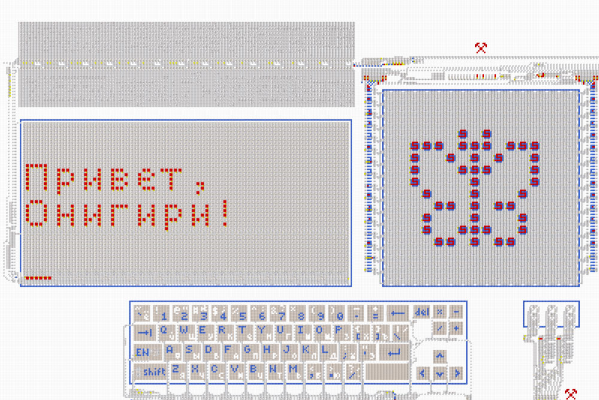
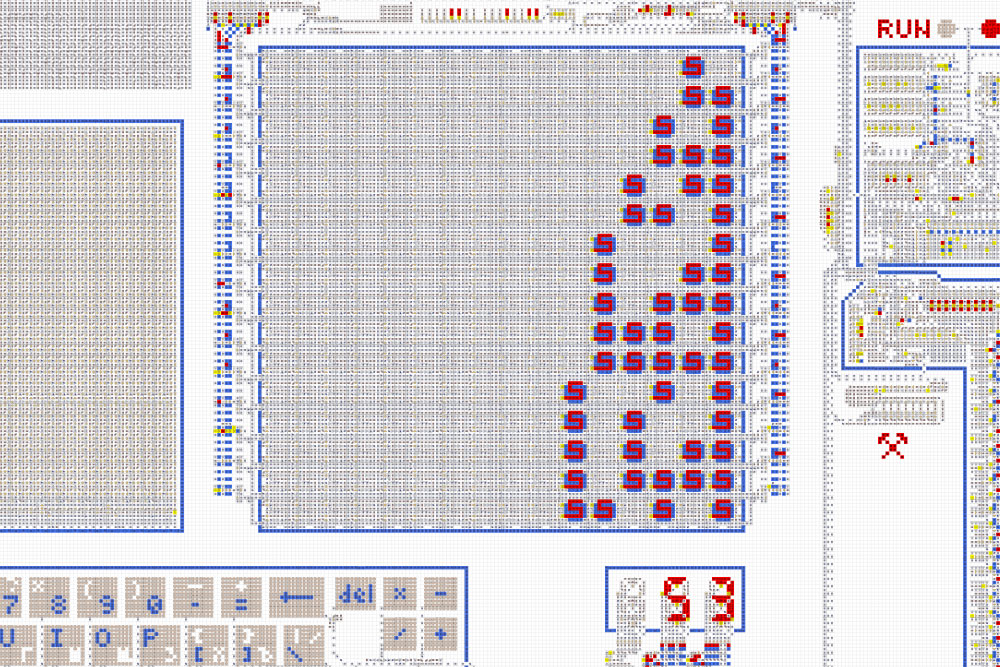
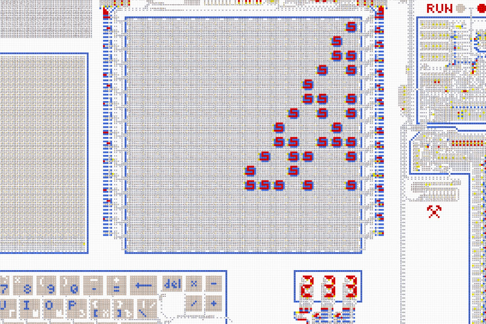
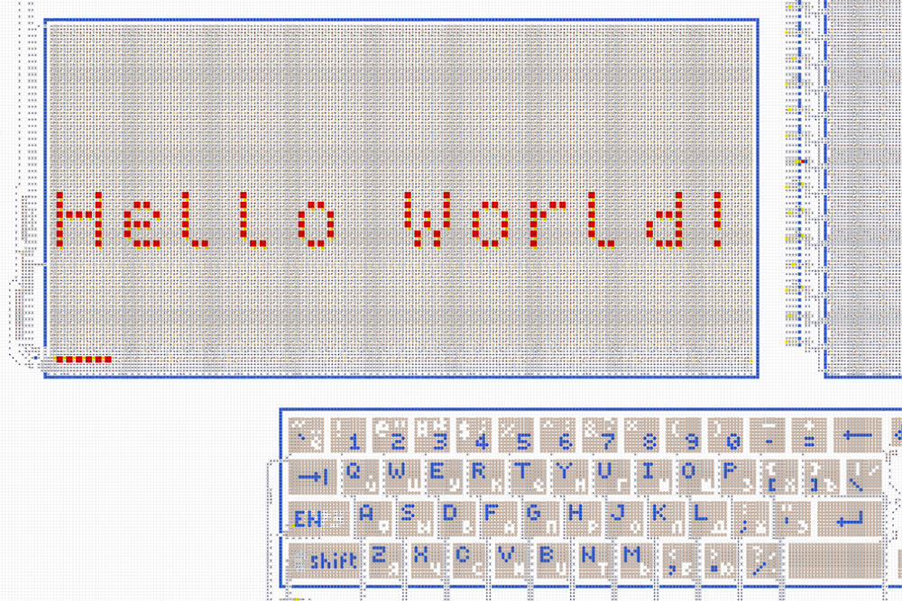

# Компьютер из стрелочек *Gen. 2*
 

<table>
  <thead>
    <tr>
      <td valign="top" width="50%">
        Полноценный компьютер, целиком сделанный из стрелочек. Позволяет создавать и запускать
        различные программы и игры.  
        <a href="https://logic-arrows.io/map-computer"><b>Карта с компьютером</b></a>  
        <a href="specification.md">Устройство и характеристики</a>  
        <a href="programming.md">Программирование</a>  
        <a href="#examples">Готовые программы</a>
      </td>
      <td valign="top">
        
      </td>
    </tr>
  </thead>
</table>
  

## Демонстрация работы
Зайдите на [карту с компьютером](https://logic-arrows.io/map-computer). В нижнем ползунке установите
максимальную скорость. Нажмите на кнопку `Demo` и дождитесь загрузки программы в память компьютера.
Во время загрузки на дисплей будет выведена цветная бабочка. Далее нажмите на кнопку `RUN` и
наблюдайте, как программа напишет в терминал «Привет, Онигири!» и трижды позвонит в
колокольчик. По окончании загорится лампочка `DONE`. Чтобы запустить на компьютере вашу собственную
программу, см. [Программирование](programming.md).
   

## Готовые программы
<table>
  <thead>
    <tr>
      <td valign="top" width="50%">
        <h3><a href="asm/game-of-life.asm">Игра «Жизнь»</a></h3>
         
        В терминал выводится название игры, дисплей заполняется случайным наборов пикселей, а на
        цифровом индикаторе отображается счётчик кадров. Затем запускается бесконечный цикл
        вычислений, на обработку одного кадра уходит около часа.
      </td>
      <td valign="top">
        <h3><a href="asm/space-fight.asm">Игра «Space Fight!»</a></h3>
         
        На дисплее внизу расположен корабль, а остальная область заполнена врагами. Нужно уничтожить
        30 врагов за ограниченное число ходов. Периодически все враги приближаются к кораблю, причём
        с каждым разом это происходит всё чаще. Если кто-то из врагов долетит до корабля, игра
        проиграна. А в случае победы на дисплей выведется приз.
      </td>
    </tr>
    <tr>
      <td valign="top">
        <h3><a href="asm/demo.asm">Demo</a></h3>
         
        Во время загрузки выводит на дисплей цветную бабочку, а при запуске пишет в терминал
        «Привет, Онигири!» и звонит в колокольчик.
      </td>
      <td valign="top">
        <h3><a href="asm/prime-numbers.asm">Prime Numbers</a></h3>
         
        Находит первые 16 простых чисел и выводит их на цифровой индикатор, а также на дисплей в
        двоичном формате. Выполнение занимает 3091 операцию.
      </td>
     </tr>
    <tr>
      <td valign="top">
        <h3><a href="asm/fibonacci-sequence.asm">Fibonacci Sequence</a></h3>
         
        Находит 12 чисел Фибоначчи. Выводит их на цифровой индикатор, а также на дисплей в двоичном
        формате.
      </td>
      <td valign="top">
        <h3><a href="asm/typewriter.asm">Typewriter</a></h3>
         
        Выводит в терминал текст, набираемый на клавиатуре.
      </td>
    </tr>
  </thead>
</table>
