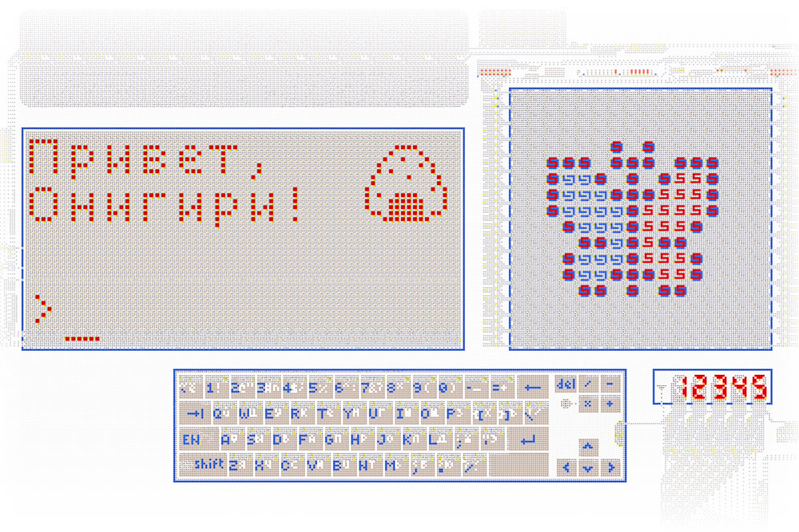
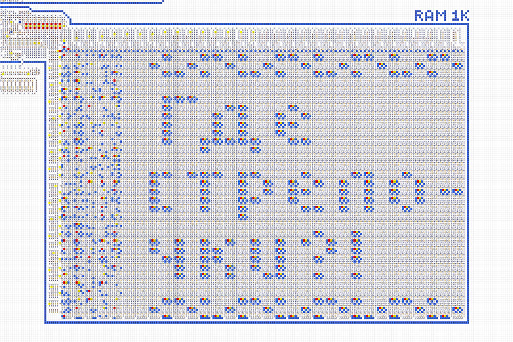

# Computer v2
 

<table>
  <thead>
    <tr>
      <td valign="top" width="50%">
        A full-fledged computer made entirely of logic arrows. It allows you to create and run
        various programs and games.  
        <a href="https://logic-arrows.io/map-computer"><b>Map with the computer</b></a>  
        <a href="specification.md">Structure and Specifications</a>  
        <a href="programming.md">Programming</a>  
        <a href="#examples">Ready-made programs</a>
      </td>
      <td valign="top">
        
      </td>
    </tr>
  </thead>
</table>
 

## Demonstration
Go to the [map with the computer](https://logic-arrows.io/map-computer). On the bottom slider, set
the maximum speed. Press the `Demo` button and wait for the program to load into the computer’s
memory. During loading, a colored butterfly will be displayed. Next, press the `RUN` button and
watch as the program writes “Hello, Onigiri!” in the terminal, draws an onigiri image, and rings the
bell three times. When finished, the `DONE` light will turn on.

To run your own program on the computer, see [Programming](programming.md).
   

## Ready-made programs
<table>
  <thead>
    <tr>
      <td valign="top" width="50%">
        <h3><a href="asm/tetris.asm">Tetris Game</a></h3>
         
        A classic puzzle game with color graphics
      </td>
      <td valign="top">
        <h3><a href="asm/game-of-life.asm">Game of Life</a></h3>
         
        Fills the display with random pixels and calculates subsequent generations
      </td>
    </tr>
    <tr>
      <td valign="top" width="50%">
        <h3><a href="asm/space-fight.asm">Space Fight Game</a></h3>
         
        Enemy ships are approaching you, which you need to shoot down within a limited time. If you
        win, you will receive a prize.
      </td>
      <td valign="top">
        <h3><a href="asm/demo.asm">Demo</a></h3>
         
        Displays a colored butterfly, writes “Hello, Onigiri!” in the terminal, draws an onigiri
        image, and rings the bell
      </td>
    </tr>
    <tr>
      <td valign="top">
        <h3><a href="asm/prime-numbers.asm">Prime Numbers</a></h3>
         
        Finds the first 16 prime numbers and outputs them to the digital indicator, as well as to
        the display in binary format
      </td>
      <td valign="top">
        <h3><a href="asm/fibonacci-sequence.asm">Fibonacci Sequence</a></h3>
         
        Finds 12 Fibonacci numbers. Outputs them to the digital indicator, as well as to the display
        in binary format
      </td>
    </tr>
    <tr>
      <td valign="top">
        <h3><a href="asm/typewriter.asm">Typewriter</a></h3>
         
        Outputs text typed on the keyboard to the terminal
      </td>
      <td valign="top">
        <h3><a href="asm/font-test.asm">Font Test</a></h3>
         
        Outputs all possible characters to the terminal (encoding
        <a href="https://en.wikipedia.org/wiki/Windows-1251">cp1251</a>)
      </td>
    </tr>
    <tr>
      <td valign="top">
        <h3><a href="asm/terminal-art.asm">Terminal Art</a></h3>
         
        Uses the terminal’s graphics mode to display an image
      </td>
      <td valign="top">
        <h3><a href="asm/ram-art.asm">RAM Art</a></h3>
         
        A joke program that uses RAM as a canvas to display an image (“Where are the arrows?!” in
        Russian)
      </td>
    </tr>
  </thead>
</table>
