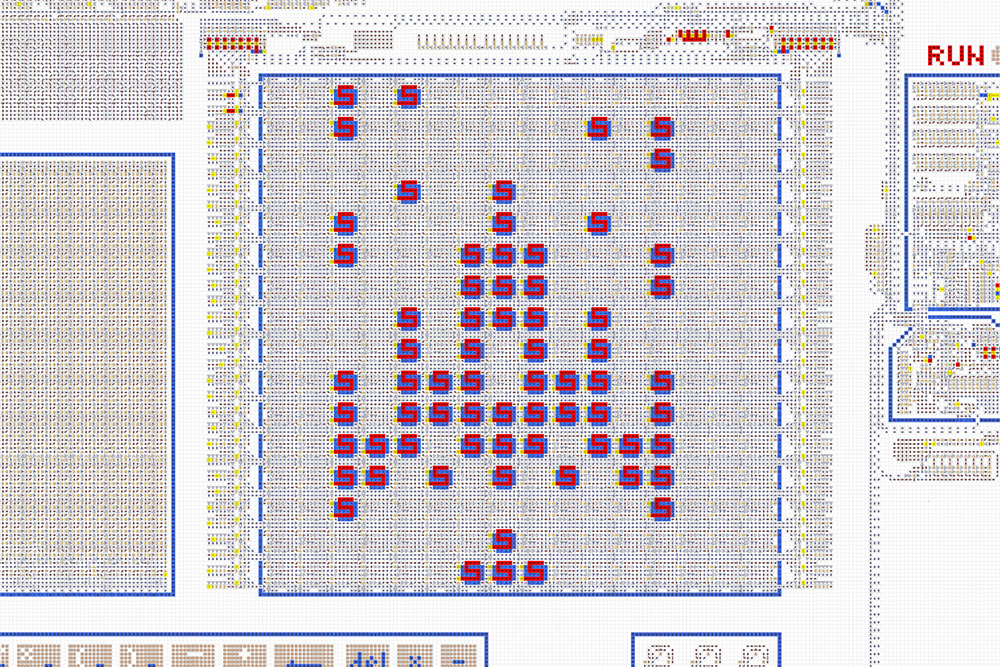

# Компьютер из стрелочек *Gen. 2*
 

<table>
  <thead>
    <tr>
      <td valign="top" width="50%">
        Полноценный компьютер, целиком сделанный из стрелочек. Позволяет создавать и запускать
        различные программы и игры.  
        <a href="https://logic-arrows.io/map-computer"><b>Карта с компьютером</b></a>  
        <a href="specification.md">Устройство и характеристики</a>  
        <a href="programming.md">Программирование</a>  
        <a href="#examples">Готовые программы</a>
      </td>
      <td valign="top">
        
      </td>
    </tr>
  </thead>
</table>
 

## Демонстрация работы
Зайдите на [карту с компьютером](https://logic-arrows.io/map-computer). В нижнем ползунке установите
максимальную скорость. Нажмите на кнопку `Demo` и дождитесь загрузки программы в память компьютера.
Во время загрузки на дисплей будет выведена цветная бабочка. Далее нажмите на кнопку `RUN` и
наблюдайте, как программа в терминале напишет «Привет, Онигири!», нарисует изображение онигири и
трижды позвонит в колокольчик. По окончании загорится лампочка `DONE`. Чтобы запустить на компьютере
вашу собственную программу, см. [Программирование](programming.md).
   

## Готовые программы
<table>
  <thead>
    <tr>
      <td valign="top" width="50%">
        <h3><a href="asm/tetris.asm">Игра «Тетрис»</a></h3>
         
        Классическая компьютерная игра-головоломка.  
        Программа занимает 888 байт.
      </td>
      <td valign="top">
        <h3><a href="asm/game-of-life.asm">Игра «Жизнь»</a></h3>
         
        Дисплей заполняет случайный набор пикселей, и запускается вычисление следующих поколений.  
        Программа занимает 512 байт.
      </td>
    </tr>
    <tr>
      <td valign="top" width="50%">
        <h3><a href="asm/space-fight.asm">Игра «Space Fight!»</a></h3>
         
        Внизу дисплея расположен корабль, а остальная область заполнена врагами. Нужно сбить 30
        врагов за ограниченное время. Враги приближаются с нарастающей скоростью, и, если враг
        достигнет корабля, игра проиграна. В случае победы на дисплее появится приз.  
        Программа занимает 256 байт.
      </td>
      <td valign="top">
        <h3><a href="asm/demo.asm">Demo</a></h3>
         
        Во время загрузки выводит на дисплей цветную бабочку. При запуске пишет в терминал
        «Привет, Онигири!», рисует изображение онигири и звонит в колокольчик.
      </td>
    </tr>
    <tr>
      <td valign="top">
        <h3><a href="asm/prime-numbers.asm">Prime Numbers</a></h3>
         
        Находит первые 16 простых чисел и выводит их на цифровой индикатор, а также на дисплей в
        двоичном формате. Выполнение занимает 3091 операцию.
      </td>
      <td valign="top">
        <h3><a href="asm/fibonacci-sequence.asm">Fibonacci Sequence</a></h3>
         
        Находит 12 чисел Фибоначчи. Выводит их на цифровой индикатор, а также на дисплей в двоичном
        формате.
      </td>
     </tr>
    <tr>
      <td valign="top">
        <h3><a href="asm/typewriter.asm">Typewriter</a></h3>
         
        Выводит в терминал текст, набираемый на клавиатуре.
      </td>
      <td valign="top">
        <h3><a href="asm/font-test.asm">Font Test</a></h3>
         
        Выводит в терминал все возможные символы (кодировка
        <a href="https://ru.wikipedia.org/wiki/Windows-1251">cp1251</a>).
      </td>
    </tr>
  </thead>
</table>
