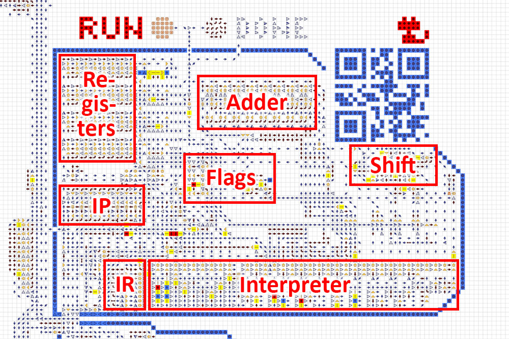
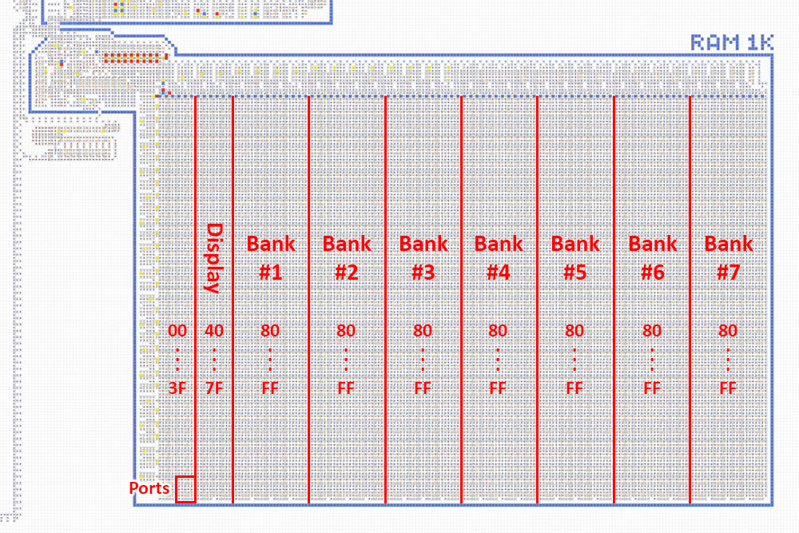
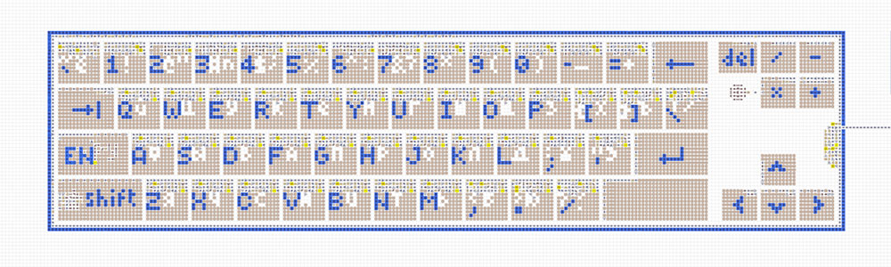
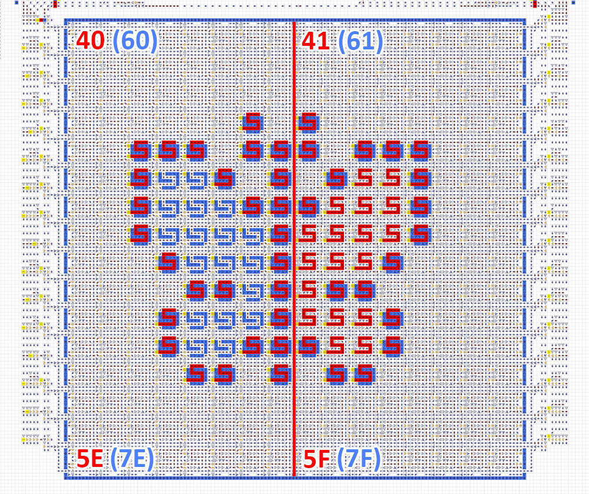
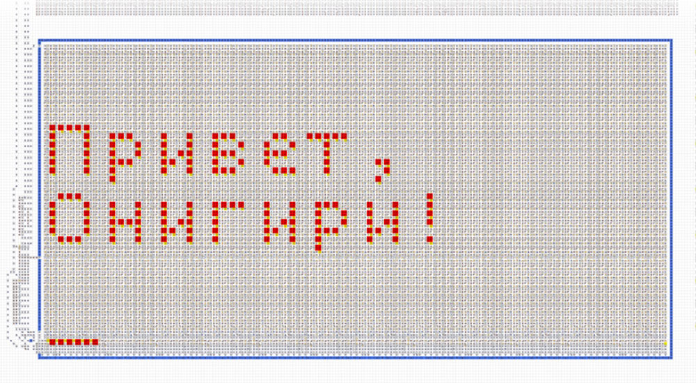

# Устройство и характеристики
Компьютер состоит из процессора, оперативной памяти, устройств ввода/вывода и набора программ.
Основные характеристики:
- 8-битная архитектура, процессор с 4 регистрами и флагами.
- Оперативная память до 32 КБ с интегрированной видеопамятью и портами.
- Ввод/вывод: клавиатура, цветной дисплей, терминал и цифровой индикатор.
- Собственный язык ассемблера (см. [Программирование](programming.md)).
- Загрузка программ со специальных дискет.
   

## Процессор
Процессор состоит из указателя инструкции `IP`, регистра инструкции `IR`, интерпретатора, 4
свободных регистров `A` `B` `C` `D`, флагов `Z` `S` `C` `O`, многофункционального сумматора,
механизма битового сдвига и ряда других мелких механизмов.

Процессор читает инструкцию из RAM по адресу, лежащему в `IP`. Инструкция попадает в `IR`, инициируя
выполнение той или иной операции. Во время выполнения операции происходит взаимодействие с
регистрами и флагами. После этого `IP` инкрементируется и процесс повторяется. Подробнее см.
[Программирование](programming.md).

  

## Оперативная память
Памятью компьютера является RAM объёмом 1 КБ. Поддерживается расширение вплоть до 32 КБ. Единицей
хранимой информации является 1 байт, адрес доступа к памяти также представляет собой 1 байт.

Т. к. 8-битный адрес может обеспечить доступ лишь по 256 адресам RAM, существует система
переключения банков через порт `3F`. При записи числа в этот порт диапазон адресов `80...FF`
переключается на банк соответствующего номера. Число `0` как исключение ссылается на банк № 1. Номер
банка не может быть предзаписан на дискете, а управляется только во время выполнения программы.

  

## Клавиатура
Полноформатная клавиатура, приближенная к реальному ПК, с крупными кнопками и подробными подписями.
Имеет латинскую и кириллическую раскладки, однократный и постоянный верхний регистр. Текущий режим
клавиатуры отображается непосредственно на кнопках переключения раскладки и регистра.

После нажатия на любую клавишу, её код может быть прочитан процессором из порта `3E`. После чтения
порт автоматически обнуляется для возможности определения повторных нажатий. Коды символов
соответствуют кодировке [`cp1251`](https://ru.wikipedia.org/wiki/Windows-1251). Клавишам `←` `↑` `→`
`↓` `Enter` соответствуют коды `11` `12` `13` `14` `0A`.

  

## Дисплей
Для подключения вывода на дисплей необходимо в порт `3E` записать байт, у которого 3 и 2-й биты
равны `01` для монохромного режима и `11` для цветного. В монохромном режиме дисплей использует
диапазон памяти `40...5F`, в цветном `40...7F`. Ниже показано соответствие адресов различным
участкам дисплея. Запись по этим адресам будет приводить к появлению на дисплее пикселей,
соответствующих записанным битам.

  

## Терминал
Размер терминала 12×4 символов с возможностью расширения до любых размеров. Имеет подвижный курсор в
нижней строке, куда можно выводить различные символы. Остальные строки являются историей и
постепенно сдвигаются вверх. Поддерживает перевод строки, возврат каретки, backspace, delete, tab и
пр. (в разработке). Поддерживает вывод произвольной графики (в разработке).

Для подключения вывода в терминал необходимо в порт `3E` записать байт, у которого 0-й бит равен
`1`. Далее, каждый байт, записанный по адресу `3C`, будет выводиться на терминал в виде символа в
кодировке [`cp1251`](https://ru.wikipedia.org/wiki/Windows-1251).

При записи по адресу `3D` байты накапливаются в буфере из 6 байт. При заполнении буфера, все байты
выводятся в терминал в виде графического символа, после чего буфер очищается (в разработке).

  

## Цифровой индикатор
Состоит из 5 десятичных цифр и отображает числа в диапазоне `0...65535`. Для подключения вывода на
цифровой индикатор необходимо в порт `3E` записать байт, у которого 1-й бит равен `1`. Далее, каждый
байт, записанный по адресу `3A`, будет преобразован в десятичный формат и отображён на цифровом
индикаторе. Байт, записанный по адресу `3B`, будет преобразован в десятичный формат с умножением на
256 (в разработке).
