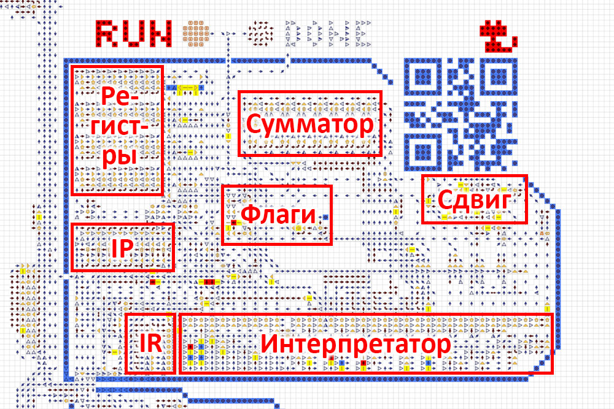
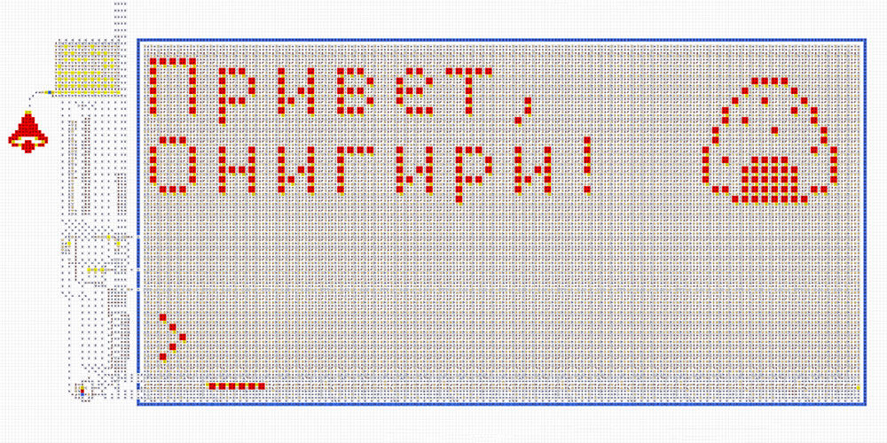

# Structure and Specifications
The computer consists of a processor, RAM, input/output devices, and a set of programs.
Main characteristics:
- 8-bit architecture, processor with 4 registers and flags.
- Up to 32 KB of RAM with integrated video memory and ports.
- Input/output: keyboard, color display, terminal, and digital indicator.
- Own assembly language (see [Programming](programming.md)).
- Loading programs from special disks.
   

## Processor
The processor consists of an instruction pointer `IP`, an instruction register `IR`, an interpreter,
free registers `A` `B` `C` `D`, flags `Z` `S` `C` `O`, a multifunctional adder, a bit shifter, and
other small mechanisms.

The processor reads an instruction from RAM at the address stored in `IP`. The instruction goes into
`IR`, initiating the execution of a particular operation. During the operation, there is interaction
with registers and flags. After that, `IP` is incremented and the process repeats. For more details,
see [Programming](programming.md).

  

## RAM
The computer’s memory is 1 KB of RAM, expandable to 32 KB. The unit of stored information is 1 byte,
and the memory access address is also 1 byte.

Since an 8-bit address can only access 256 RAM addresses, there is a memory bank switching system.
By default, bank #1 is connected, but if a number is written to port `3F`, the address range
`80...FF` will switch to the bank of the corresponding number. The number `0` as an exception
connects bank #1.

  

## Keyboard
A full-format keyboard, similar to a real PC. It has Latin and Cyrillic layouts, single and permanent
upper case. All modes are displayed on the corresponding keys. It also has an indicator that suggests
when the next character can be entered.

After entering any character, its code can be read by the program from port `3E`. After reading, the
port is automatically reset to allow for the detection of repeated input. The character codes
correspond to the [`cp1251`](https://en.wikipedia.org/wiki/Windows-1251) encoding. The keys `←` `↑`
`→` `↓` `Enter` correspond to the codes `11` `12` `13` `14` `0A`.

  

## Display
To connect the output to the display, you need to write a value to port `3E` with bits 5 and 4 equal
to `01` for monochrome mode or `11` for color mode. In monochrome mode, the display uses the memory
range `40...5F`, and in color mode `40...7F`. The correspondence of addresses to different parts of
the display is shown below. Sending data to these addresses results in the appearance of
corresponding pixels on the display.

  

## Terminal
The terminal size is 12×4 characters with the possibility of expansion to any size. It has a movable
cursor in the bottom row where various characters can be displayed. The other rows are history and
gradually scroll up. It supports the commands `\a` `\b` `\t` `\n` `\v` `\f` `\r` `delete` and cursor
movement with arrow keys.

To connect the output to the terminal, you need to write a value with bit 0 set to port `3E`. Then,
each byte sent to address `3C` is output to the terminal as a character in the
[`cp1251`](https://en.wikipedia.org/wiki/Windows-1251) encoding. Six bytes sent sequentially to
address `3D` are output to the terminal as one graphic character.

  

## Digital Indicator
It consists of 5 decimal digits and has two operating modes: unsigned with a range of `0...65535`
and signed with a range of `−32768...+32767`. To connect the output to the digital indicator, you
need to write a value to port `3E` with bits 3 and 2 equal to `01` for unsigned mode or `11` for
signed mode. Then, each byte sent to address `3A` is converted to decimal format and output to the
digital indicator. A byte sent to address `3B` is converted to decimal format with multiplication by
256.

