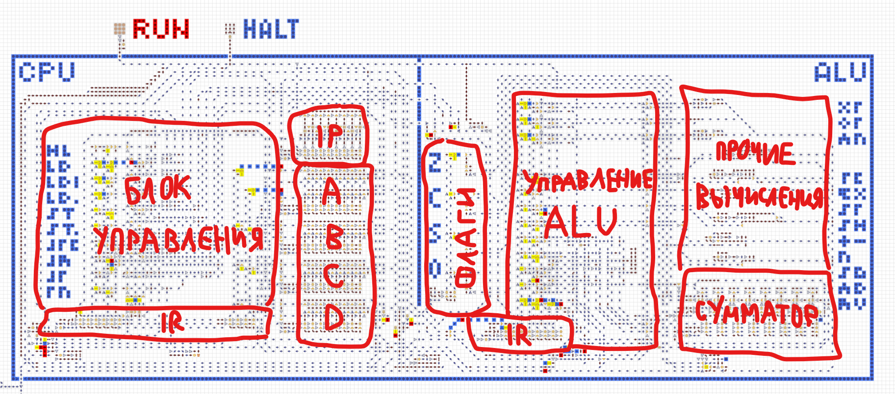
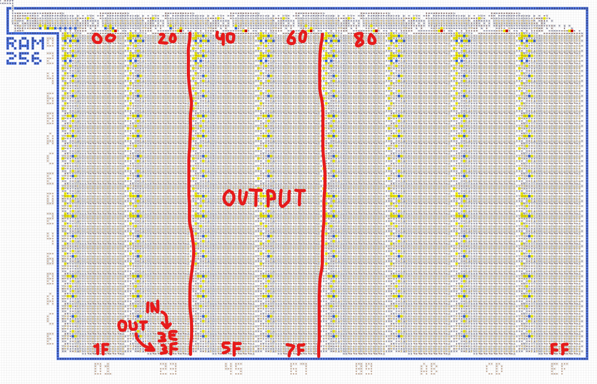
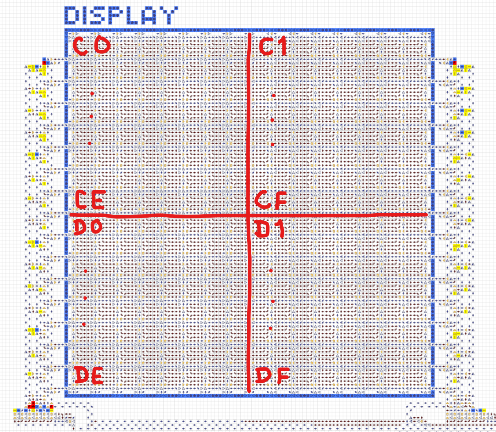

### [← В начало](./README.md)

# Компьютер из стрелочек
[Перейти на карту →](https://logic-arrows.io/map-computer)
[](https://logic-arrows.io/map-computer)

Полноценный компьютер, состоящий из процессора, оперативной памяти, ввода/вывода и набора программ. Характеристики:
* 8-битная архитектура, процессор с 4 регистрами и флагами
* 256 байт RAM с интегрированной видеопамятью, других видов памяти нет
* Собственный язык ассемблера (см. ниже)
* Возможность подключать множество средств ввода и вывода и программно переключаться между ними
* Возможность загружать в RAM разный исполняемый код со специальных «дискет»
<br><br><br>

## Содержание
[Демонстрация работы](#demo)

Устройство:
- [Процессор](#cpu)
- [Оперативная память](#ram)
- [Система ввода](#input)
- [Система вывода](#output)

[Создание своей программы](#programming)

[Примеры готовых программ](#examples)
<br><br><br>


## <a name="demo"></a>Демонстрация работы
Зайдите на [карту](https://logic-arrows.io/map-computer) с компьютером. В ползунке внизу справа установите максимальую скорость. Нажмите на кнопку, подписанную `Hello world`, чтобы загрузить соответствующую программу с «дискеты» в оперативную память. Дождитесь окончания загрузки. Далее нажмите на кнопку `RUN` и наблюдайте выполнение программы, в процессе которого на пиксельном дисплее слева постепенно выведется надпись «Hello world» и котик. По окончании выполнения программы загорится лампочка `DONE`.
<br><br><br>


## <a name="cpu"></a>Процессор
Процессор состоит из двух частей: управляющей и вычислительной (ALU). Управляющая часть состоит из указателя операции `IP`, регистра операции `IR`, блока управления и 4 свободных регистров `A` `B` `C` `D`. Вычислительная часть состоит из регистра операции `IR`, 4 флагов `Z` `C` `S` `O`, блока управления и исполняющих механизмов, включающих многофункциональный сумматор.

Процессор читает команду из RAM по адресу, лежащему в `IP`, после чего `IP` инкрементируется. Прочитанная команда попадает в `IR` и блоки управления инициируют ту или иную операцию. Некоторые команды требуют дополнительного аргумента, который читается из RAM по адресу, следующему за самой командой. Команды активно работают с регистрами `A` `B` `C` `D`, подготавливая данные для ALU.

Типичная операция ALU читает информацию из двух совободных регистров, производит вычисление между ними и сохраняет результат в один из этих же регистров. Также, в зависимости от типа вычисления ALU выставляет или сбрасывает те или иные флаги. Эти флаги впоследствии могут быть использованы программой в качестве условия для принятия решений.

Подробнее см. [Команды ассемблера](./computer-assembly.md).


<br><br><br>


## <a name="ram"></a>Оперативная память
Единственной памятью компьютера является RAM на 256 байт. Единицей хранимой информации является 1 байт, адрес доступа к памяти также представляет собой 1 байт.

Адрес `BE` подключён к системе ввода. По этому адресу всегда можно прочитать актуальную информацию, например, о нажатой клавише на клавиатуре.

Адрес `BF` подключён к управлению выводом. К примеру, если записать по этому адресу байт `10`, то вывод переключится на цифровой дисплей, а если записать `80`, то на пиксельный дисплей.

Адреса `С0...FF` являются совмещённой видеопамятью. Запись в по этим адресам может также воздействовать на текущее средство вывода, в записимости от его типа.


<br><br><br>


## <a name="input"></a>Система ввода
*Описание в разработке*
<br><br><br>


## <a name="output"></a>Система вывода

### • Пиксельный дисплей
Для переключения вывода на пиксельный дисплей необходимо в RAM по адресу `BF` записать байт `80`. Ниже показано адресное пространство дисплея. Запись в RAM по адресу из этого пространста будет приводить к появлению на дисплее пикселей, соответствующих записанным битам.


<br>

### • Другие средства вывода
*Описание в разработке*
<br><br><br>


## <a name="programming"></a>Создание своей программы
Программы создаются на ассемблере, специально разработанном для этого компьютера. Подробнее см. [Команды ассемблера](./computer-assembly.md).

*Описание в разработке*
<br><br><br>


## <a name="examples"></a>Примеры готовых программ
Hello world:
```asm
ldi a, 0x80
st a, 0xBF
ldi b, 0x20
ldi c, 0x18
ldi d, 0xC0
loop:
    ld a, c
    st a, d
    inc c
    inc d
    dec b
    jnz loop
hlt
```
