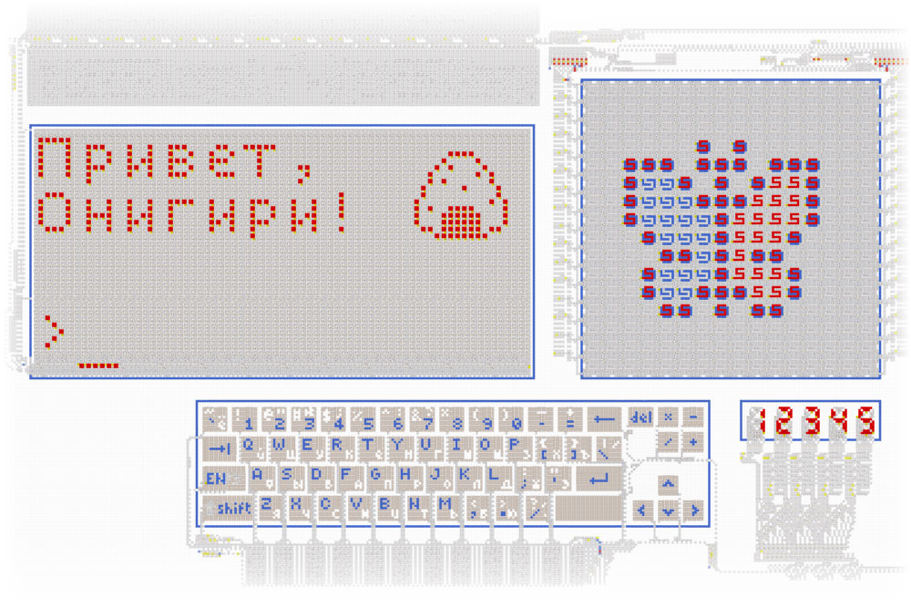
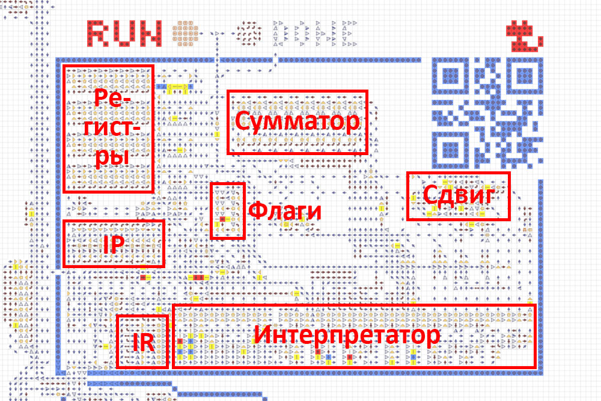
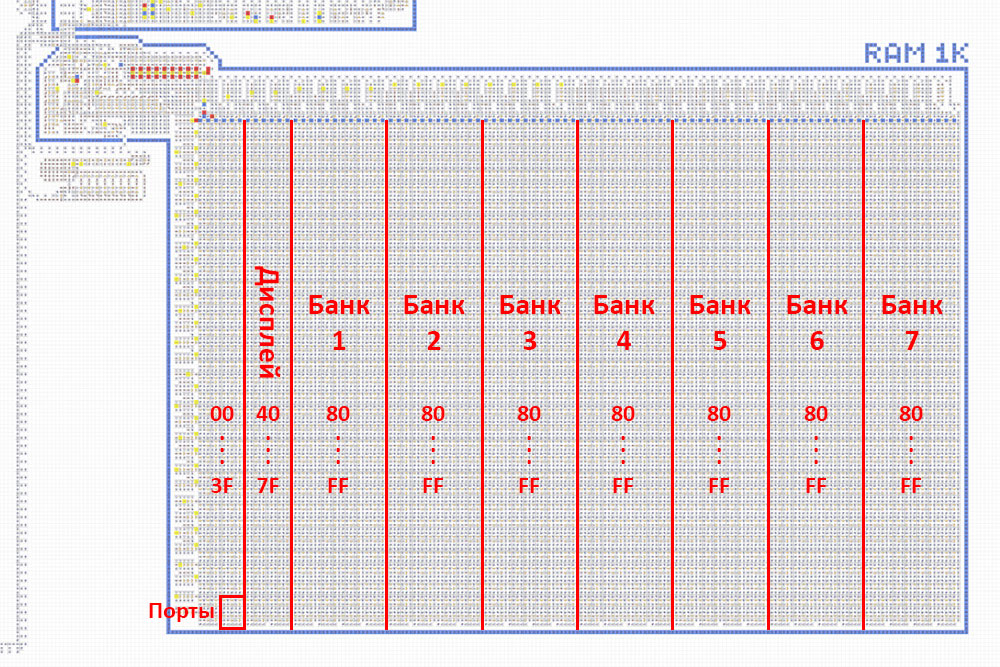
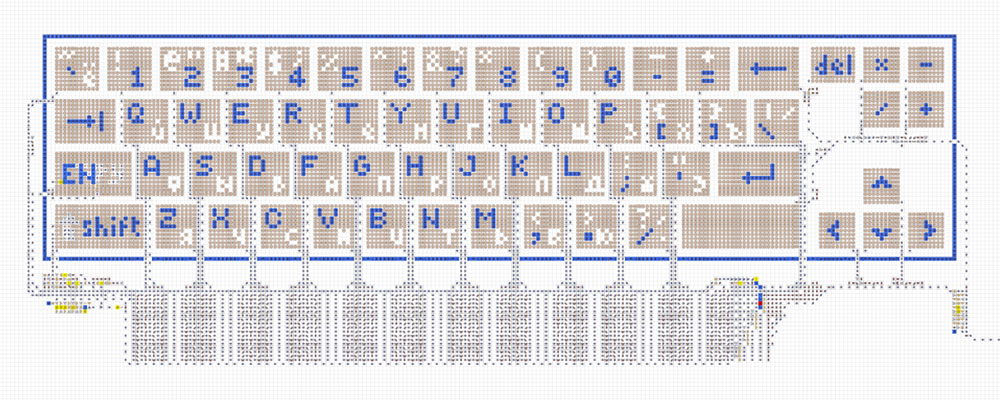
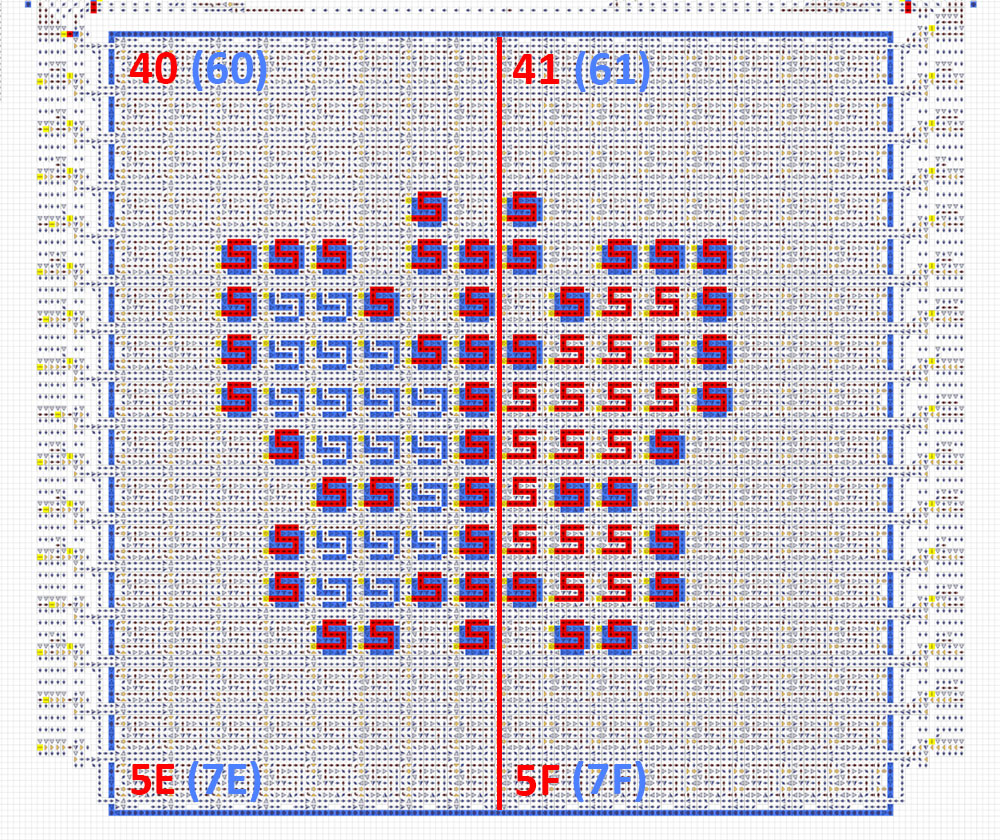
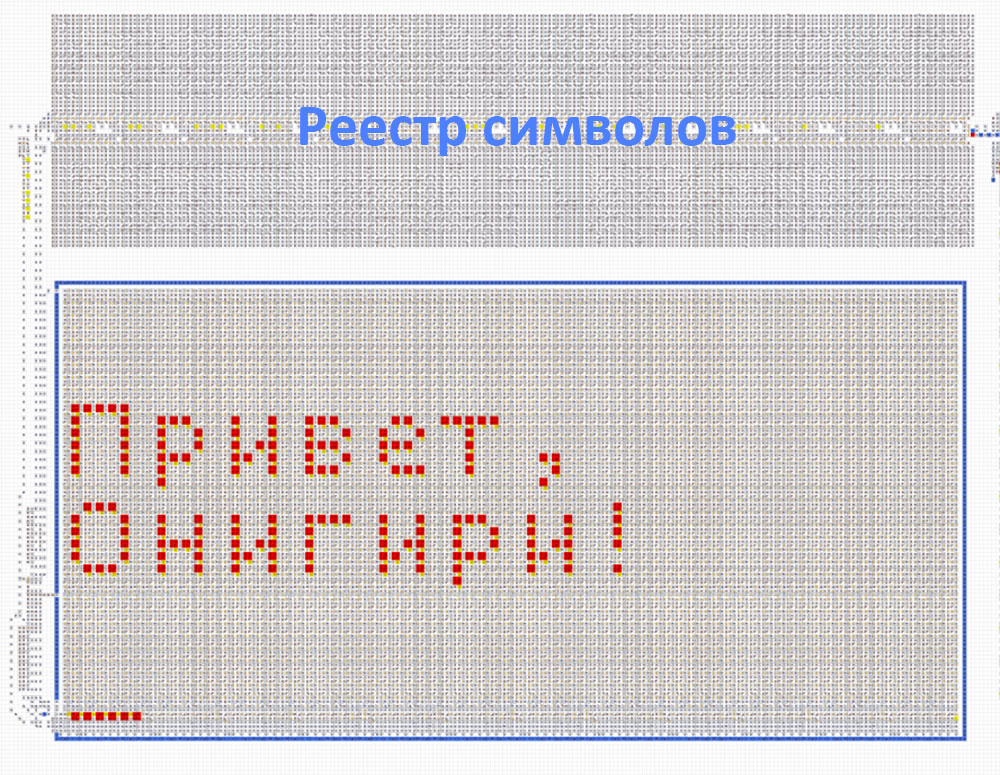

### [← В начало](README.md)

# Компьютер из стрелочек v2
[Перейти на карту →](https://logic-arrows.io/map-computer)

Полноценный компьютер, состоящий из процессора, оперативной памяти, ввода/вывода и набора программ. Характеристики:
- 8-битная архитектура, процессор с 4 регистрами и флагами
- RAM до 32 КБ с интегрированной видеопамятью и портами
- Собственный язык ассемблера (см. ниже)
- Возможность программно подключать несколько средств вывода
- Возможность загружать в RAM разный исполняемый код со специальных «дискет»
   

## Содержание
[Демонстрация работы](#demo)

[Процессор](#cpu)

[Оперативная память](#ram)

[Клавиатура](#keyboard)

[Дисплей](#display)

[Терминал](#terminal)

[Цифровой индикатор](#bcd)

[Программирование](#programming)

[Примеры программ](#examples)
   

## Демонстрация работы
Зайдите на [карту](https://logic-arrows.io/map-computer) с компьютером. В ползунке внизу справа установите максимальную скорость. Нажмите на кнопку, подписанную `DEMO`, чтобы загрузить соответствующую программу с дискеты в оперативную память. В процессе загрузки на экране дисплея появится изображение бабочки. Дождитесь окончания загрузки. Далее нажмите на кнопку `RUN` и наблюдайте выполнение программы, в процессе которого в терминале появится надпись «Привет, Онигири!». По окончании выполнения программы загорится лампочка `DONE`.
   

## Процессор
Процессор состоит из указателя операции `IP`, регистра операции `IR`, интерпретатора операции, 4 свободных регистров `A` `B` `C` `D`, флагов `Z` `S` `C` `O`, многофункционального сумматора, механизма битового сдвига и ряда мелких механизмов.

Процессор читает команду из RAM по адресу, лежащему в `IP`, после чего `IP` инкрементируется. Прочитанная команда попадает в `IR`, и интерпретатор инициируют ту или иную операцию. Некоторые команды требуют дополнительного аргумента, который читается из RAM по адресу, следующему за командой. Команды активно работают с регистрами `A` `B` `C` `D`, подготавливая данные для вычислений.

Типичная вычислительная операция читает информацию из двух регистров, производит между ними вычисление и сохраняет результат в один из этих же регистров. В зависимости от типа вычисления операция выставляет или сбрасывает те или иные флаги. Эти флаги впоследствии могут быть использованы программой в качестве условия для принятия решений.

Подробнее см. [Программирование](computer-programming.md).

   

## Оперативная память
Памятью компьютера является RAM размером 1 КБ с возможностью расширения до 32 КБ. Единицей хранимой информации является 1 байт, адрес доступа к памяти также представляет собой 1 байт.

Т. к. 8-битный адрес может обеспечить доступ лишь по 256 адресам RAM, существует система переключения банков через порт `3F`. При записи числа в этот порт диапазон адресов `80...FF` переключается на банк соответствующего номера. Банка № 0 не существует, поэтому число `0` воспринимается как `1` и ссылается на банк № 1. Номер банка не может быть предзаписан на дискете, а управляется только в процессе выполнения программы.

   

## Клавиатура
Полноформатная клавиатура, приближенная к реальному ПК, с крупными кнопками и подробными подписями. Имеет латинскую и кириллическую раскладки, однократный и постоянный верхний регистр. Текущий режим клавиатуры отображается непосредственно на кнопках переключения раскладки и регистра. Коды символов соответствуют кодировке [`cp1251`](https://ru.wikipedia.org/wiki/Windows-1251). Клавишам `←` `↑` `→` `↓` `Enter` соответствуют коды `11` `12` `13` `14` `0A`.

После нажатия на любую клавишу, её код может быть прочитан процессором из порта `3E`. После чтения порт автоматически обнуляется для возможности определения повторных нажатий.

   

## Дисплей
Для подключения вывода на дисплей необходимо в порт `3E` записать байт, у которого 3 и 2-й биты равны `01` для монохромного режима и `11` для цветного (в разработке). В монохромном режиме дисплей использует диапазон памяти `40...5F`, в цветном `40...7F`. Запись по этим адресам будет приводить к появлению на дисплее пикселей, соответствующих записанным битам. Ниже показано соответствие адресов различным участкам дисплея.

   

## Терминал
Размер терминала 12×4 символов с возможностью расширения до любых размеров. Имеет подвижный курсор в нижней строке, куда можно выводить различные символы. Остальные строки являются историей и постепенно сдвигаются вверх. Поддерживает перевод строки, возврат каретки, backspace, delete, tab и пр. (в разработке). Поддерживает вывод произвольной графики (в разработке).

Для подключения вывода в терминал необходимо в порт `3E` записать байт, у которого 0-й бит равен `1`. Далее, каждый байт, записанный по адресу `3C`, будет выводиться на терминал в виде символа в кодировке [`cp1251`](https://ru.wikipedia.org/wiki/Windows-1251). При записи по адресу `3D` байты накапливаются в буфере из 6 байт. При заполнении буфера, все байты выводятся в терминал в виде графического символа, после чего буфер обнуляется (в разработке).

   

## Цифровой индикатор
Состоит из 5 десятичных цифр и отображает числа в диапазоне `0...65535`. Для подключения вывода на индикатор необходимо в порт `3E` записать байт, у которого 1-й бит равен `1`. Далее, байт, записанный по адресу `3A`, будет преобразован в десятичный формат и отображён на индикаторе. Байт, записанный по адресу `3B`, будет преобразован в десятичный формат с умножением на 256 (в разработке).
   

## Программирование
См. [Программирование](computer-programming.md).
   

## Примеры программ
См. [Примеры программ](computer-examples.md).
