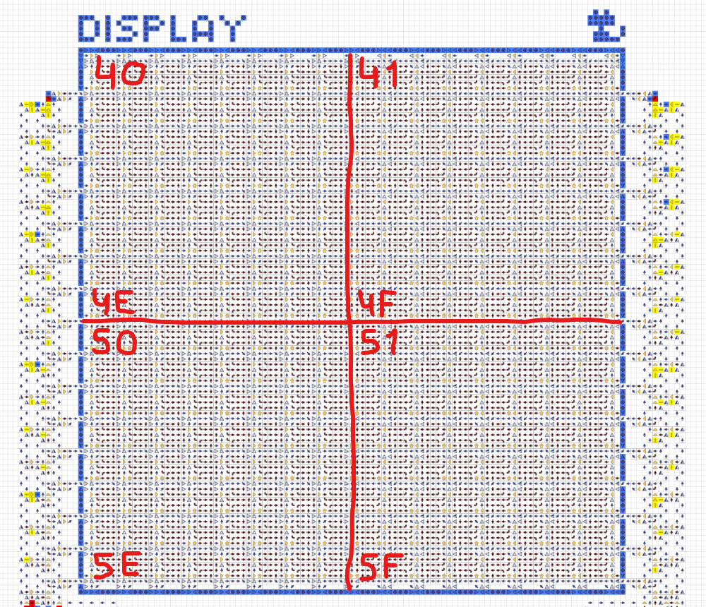

# Устройство и характеристики
Компьютер состоит из процессора, оперативной памяти, устройств ввода/вывода и набора программ.
Основные характеристики:
- 8-битная архитектура, процессор с 4 регистрами и флагами.
- Оперативная память 256 байт с интегрированной видеопамятью и портами.
- Ввод/вывод: клавиатура, дисплей, терминал и цифровой индикатор.
- Собственный язык ассемблера (см. [Программирование](programming.md)).
- Загрузка программ со специальных дискет.
   

## Процессор
Процессор состоит из двух частей: управляющей и вычислительной (ALU). Управляющая часть состоит из
указателя инструкции `IP`, регистра инструкции `IR`, блока управления и свободных регистров `A` `B`
`C` `D`. Вычислительная часть состоит из регистра инструкции `IR`, флагов `Z` `C` `S` `O`, блока
управления, многофункционального сумматора и других мелких механизмов.

Процессор читает инструкцию из RAM по адресу, лежащему в `IP`. Инструкция попадает в `IR`, инициируя
выполнение той или иной операции. Во время выполнения операции происходит взаимодействие с
регистрами и флагами. После этого `IP` инкрементируется и процесс повторяется. Подробнее см.
[Программирование](programming.md).

  

## Оперативная память
Памятью компьютера является RAM объёмом 256 байт. Единицей хранимой информации является 1 байт,
адрес доступа к памяти также представляет собой 1 байт.

Порт ввода `3E` подключён к клавиатуре. Порт вывода `3F` позволяет переключаться между различными
средствами вывода. Диапазон адресов `40...7F` является совмещённой видеопамятью.

  

## Клавиатура
После ввода любого символа, его код может быть прочитан программой из порта `3E`. Для определения
повторного ввода программе следует самостоятельно сбросить значение в порту. Коды символов
соответствуют кодировке [`cp1251`](https://ru.wikipedia.org/wiki/Windows-1251). Клавишам `←` `↑`
`→` `↓` `Enter` соответствуют коды `11` `12` `13` `14` `0A`.

  

## Дисплей
Для переключения вывода на дисплей необходимо в порт `3F` записать байт `80`. Ниже показано
соответствие адресов различным участкам дисплея. Отправка данных по этим адресам приводит к
появлению на дисплее соответствующих пикселей.

  

## Терминал
Для переключения вывода на терминал необходимо в порт `3F` записать байт `40`. Далее, каждый байт,
отправленный по адресу `40`, выводится в терминал как символ в кодировке
[`cp1251`](https://ru.wikipedia.org/wiki/Windows-1251), сдвигая все предыдущие символы влево и далее
на строчку выше.

  

## Цифровой индикатор
Состоит из 3 десятичных цифр и отображает числа в диапазоне `0...255`. Для переключения вывода на
цифровой индикатор необходимо в порт `3F` записать байт `10`. Далее, каждый байт, отправленный по
адресу `40`, преобразуется в десятичный формат и выводится на цифровой индикатор.

