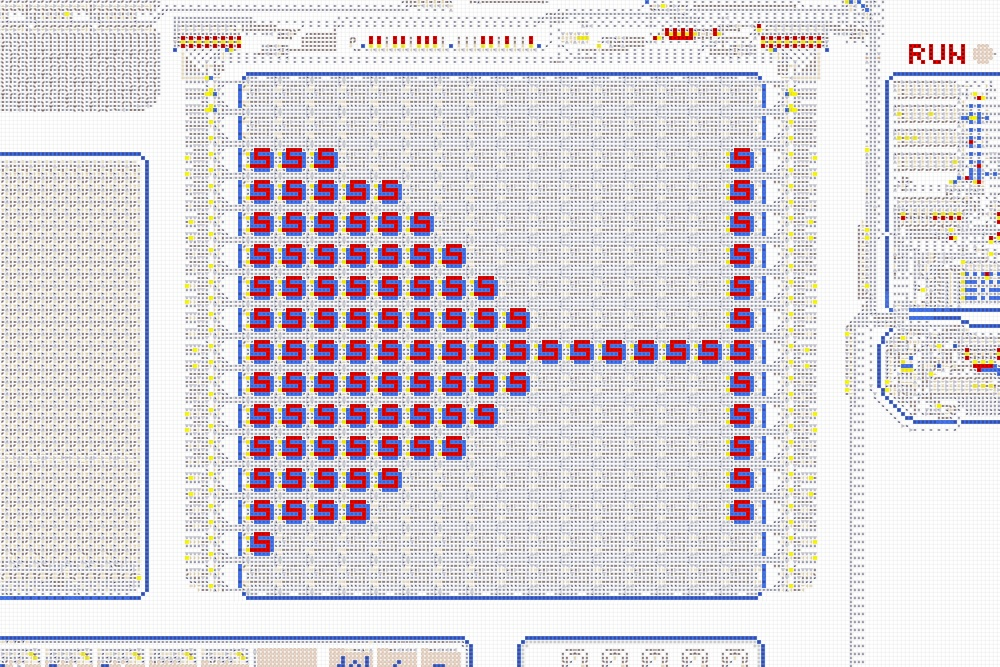
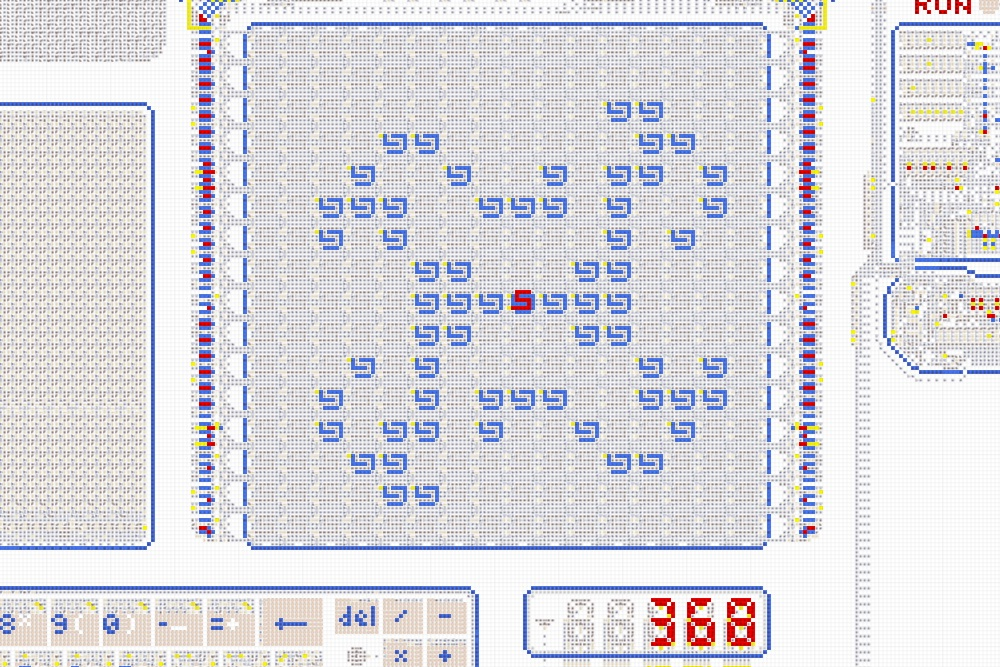

# Компьютер v2
🌐 [English](../../computer-v2/README.md) | Русский
  

<table>
  <thead>
    <tr>
      <td valign="top" width="50%">
        Полноценный компьютер, целиком собранный из стрелочек: 8-битный процессор, до 32 КБ памяти,
        клавиатура, цветной дисплей, терминал, цифровой индикатор и набор дискет с программами и
        играми, созданными в том числе участниками сообщества.  
        <ul>
          <li><a href="https://logic-arrows.io/map-computer"><b>Карта с компьютером ⇾</b></a></li>
        </ul>
        <ul>
          <li><a href="specification.md">Устройство и характеристики</a></li>
          <li><a href="programming.md">Программирование</a></li>
          <li><a href="#examples">Готовые программы</a></li>
          <li><a href="#links">Ссылки</a></li>
        </ul>
      </td>
      <td valign="top">
        
      </td>
    </tr>
  </thead>
</table>
 

## Демонстрация работы
Зайдите на [карту с компьютером](https://logic-arrows.io/map-computer). В нижнем ползунке установите
максимальную скорость. Нажмите на кнопку `Demo` и дождитесь загрузки программы в память компьютера.
Во время загрузки на дисплей будет выведена цветная бабочка. Далее нажмите на кнопку `RUN` и
наблюдайте, как программа в терминале напишет «Hello, Onigiri!», нарисует изображение онигири и
позвонит в колокольчик. По окончании загорится лампочка `DONE`.

Чтобы запустить на компьютере вашу собственную программу, см. [Программирование](programming.md).
   

## Готовые программы
<table>
  <thead>
    <tr>
      <td valign="top" width="33%">
        <a href="asm/tetris.asm">
           
          <b>Игра «Тетрис»</b>
        </a> 
        Заполняйте ряды и повышайте счёт. Классическая игра-головоломка с цветной графикой.  
      </td>
      <td valign="top" width="33%">
        <a href="asm/game-of-life.asm">
           
          <b>Игра «Жизнь»</b>
        </a> 
        Заполняет дисплей случайными пикселями и вычисляет последующие поколения  
      </td>
      <td valign="top" width="33%">
        <a href="https://github.com/mihail-moseev/program_for_computer_in_logic-arrows/blob/main/code%203d%20maze.asm">
           
          <b>Игра «3D-лабиринт»</b>
        </a> 
        Найдите выход из лабиринта, глядя от первого лица. Трёхмерная графика строится через
        рейкастинг. Автор — <a href="https://github.com/mihail-moseev/program_for_computer_in_logic-arrows">
        Михаил Мосеев</a>.  
      </td>
    </tr>
    <tr>
      <td valign="top">
        <a href="asm/community/arkanoid.asm">
           
          <b>Игра «Арканоид»</b>
        </a> 
        Отбивайте мяч платформой, чтобы разбить все блоки на экране. Автор —
        <a href="https://github.com/farmer2010">Farmer_2010</a>.  
      </td>
      <td valign="top">
        <a href="https://github.com/mihail-moseev/program_for_computer_in_logic-arrows/blob/main/code%20snake.asm">
           
          <b>Игра «Змейка»</b>
        </a> 
        Собирайте яблоки и не врезайтесь в собственный хвост. Автор —
        <a href="https://github.com/mihail-moseev/program_for_computer_in_logic-arrows">
        Михаил Мосеев</a>.  
      </td>
      <td valign="top">
        <a href="asm/space-fight.asm">
           
          <b>Игра «Бой в космосе»</b>
        </a> 
        К вам приближаются вражеские корабли, которые нужно сбить за ограниченное время. В случае
        победы вы получите приз.  
      </td>
    </tr>
    <tr>
      <td valign="top">
        <a href="https://github.com/mihail-moseev/program_for_computer_in_logic-arrows/blob/main/code%20minesweeper.asm">
           
          <b>Игра «Сапёр»</b>
        </a> 
        Открывайте клетки, ориентируясь по цифрам, и не подорвитесь на мине. Автор —
        <a href="https://github.com/mihail-moseev/program_for_computer_in_logic-arrows">
        Михаил Мосеев</a>.  
      </td>
      <td valign="top">
        <a href="asm/guess-number.asm">
           
          <b>Игра «Угадай число»</b>
        </a> 
        Угадывайте числа по правилу «больше/меньше» и повышайте общий счёт побед  
      </td>
      <td valign="top">
        <a href="asm/community/maze-generator.asm">
           
          <b>Генератор лабиринтов</b>
        </a> 
        Генерирует на дисплее случайный лабиринт методом поиска с возвратом. Автор —
        <a href="https://github.com/farmer2010">Farmer_2010</a>.  
      </td>
    </tr>
    <tr>
      <td valign="top">
        <a href="asm/community/1d-cellular-automaton.asm">
           
          <b>1D клеточный автомат</b>
        </a> 
        Введите правило в двоичном виде и наблюдайте за эволюцией клеток на дисплее. Автор —
        <a href="https://github.com/farmer2010">Farmer_2010</a>.  
      </td>
      <td valign="top">
        <a href="asm/community/langton-ant.asm">
           
          <b>Муравей Лэнгтона</b>
        </a> 
        Муравей ползает по дисплею, перекрашивает клетки и поворачивает по простому правилу,
        порождая сложный узор. Автор —
        <a href="https://github.com/farmer2010">Farmer_2010</a>.  
      </td>
      <td valign="top">
        <a href="asm/demo.asm">
           
          <b>Демо</b>
        </a> 
        Выводит на дисплей цветную бабочку, пишет в терминал «Hello, Onigiri!», рисует изображение
        онигири и звонит в колокольчик  
      </td>
    </tr>
    <tr>
      <td valign="top">
        <a href="https://github.com/mihail-moseev/program_for_computer_in_logic-arrows/blob/main/code%20tennis.asm">
           
          <b>Игра «Теннис»</b>
        </a> 
        Отбивайте мяч платформой, не давая ему упасть и зарабатывая очки. Автор —
        <a href="https://github.com/mihail-moseev/program_for_computer_in_logic-arrows">
        Михаил Мосеев</a>.  
      </td>
      <td valign="top">
        <a href="asm/prime-numbers.asm">
           
          <b>Простые числа</b>
        </a> 
        Находит 16 простых чисел и выводит их на цифровой индикатор, а также на дисплей в двоичном
        формате  
      </td>
      <td valign="top">
        <a href="asm/fibonacci-sequence.asm">
           
          <b>Числа Фибоначчи</b>
        </a> 
        Находит 12 чисел Фибоначчи. Выводит их на цифровой индикатор, а также на дисплей в двоичном
        формате  
      </td>
    </tr>
    <tr>
      <td valign="top">
        <a href="asm/terminal-art.asm">
           
          <b>Арт в терминале</b>
        </a> 
        Использует графический режим терминала для вывода изображения  
      </td>
      <td valign="top">
        <a href="asm/ram-art.asm">
           
          <b>Арт в RAM</b>
        </a> 
        Программа-шутка, использует RAM как холст для вывода изображения  
      </td>
      <td valign="top">
        <a href="asm/typewriter.asm">
           
          <b>Пишущая машинка</b>
        </a> 
        Выводит в терминал текст, набираемый на клавиатуре  
      </td>
    </tr>
    <tr>
      <td valign="top">
        <a href="asm/font-test.asm">
           
          <b>Тест шрифта</b>
        </a> 
        Выводит в терминал все возможные символы (кодировка
        <a href="https://ru.wikipedia.org/wiki/Windows-1251">cp1251</a>)  
      </td>
    </tr>
  </thead>
</table>
 

## Ссылки

- [Онлайн-компилятор](https://chubrik.github.io/arrows-compiler/) – напишите программу и получите
  дискету для вставки в игру
- [GraphDLC](https://github.com/MerinPrime/GraphDLC) – необходимое расширение для браузера,
  ускоряющее Стрелочки в 5000 раз
- [Программы Михаила Мосеева](https://github.com/mihail-moseev/program_for_computer_in_logic-arrows)
  – репозиторий автора нескольких программ из списка выше
- [Эмулятор на Python](https://github.com/farmer2010/Chubrik-processor-emulator) – написан
  участником сообщества Farmer_2010, автором нескольких программ из списка выше
- [Эмулятор на C](https://github.com/KittenAmogus/ACPUEmulator) – написан участником сообщества
  KittenAmogus, проект в разработке
- [Дискорд-сервер](https://discord.gg/8FMuQuMFCN) и [Телеграм-канал](https://t.me/logic_arrows) –
  здесь обсуждают компьютер, делятся идеями и новыми программами
- [Компьютер v1](../computer-v1/README.md) – ранняя версия компьютера, созданная по физическому
  прототипу
