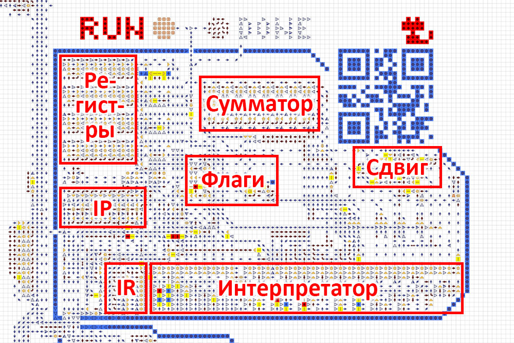
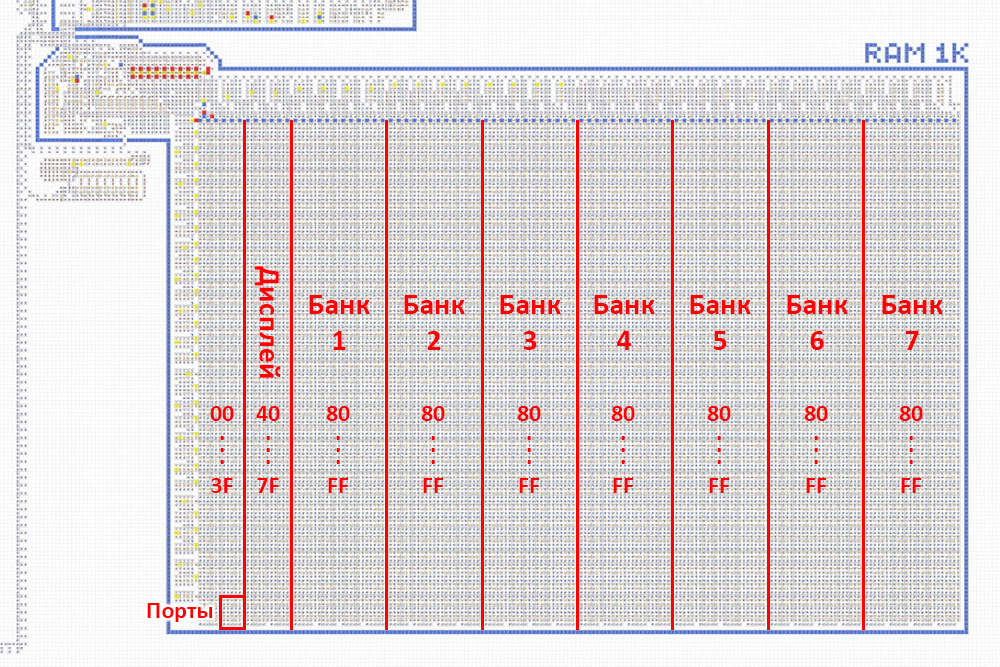
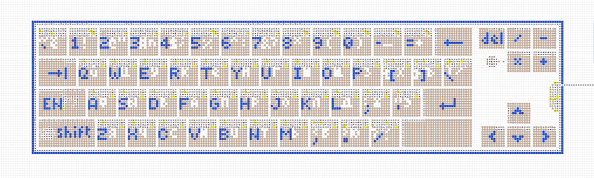
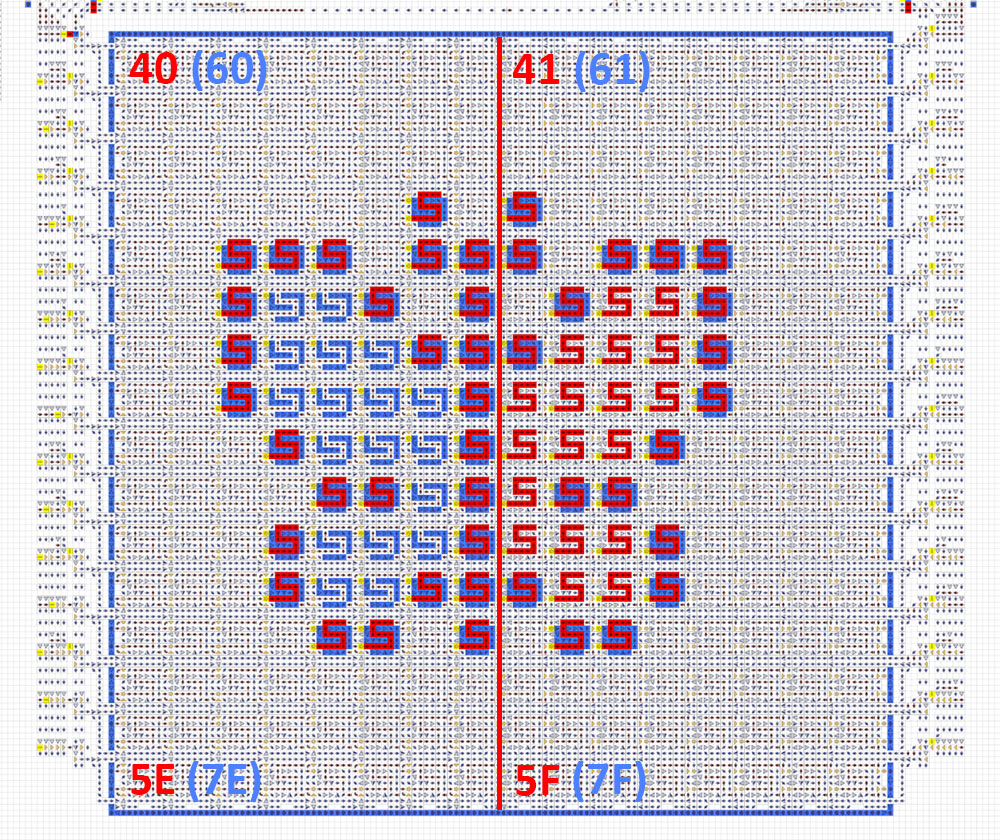
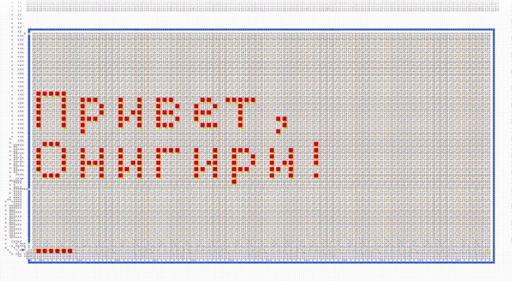
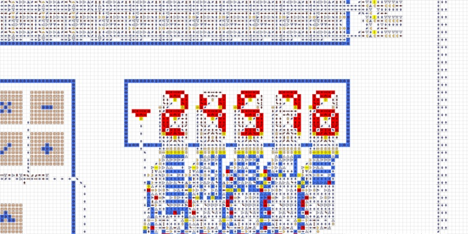

# Устройство и характеристики
 

Компьютер состоит из процессора, оперативной памяти, устройств ввода/вывода и набора программ.
Основные характеристики:
- 8-битная архитектура, процессор с 4 регистрами и флагами.
- Оперативная память до 32 КБ с интегрированной видеопамятью и портами.
- Ввод/вывод: клавиатура, цветной дисплей, терминал и цифровой индикатор.
- Собственный язык ассемблера (см. [Программирование](programming.md)).
- Загрузка программ со специальных дискет.
   

## Процессор
Процессор состоит из указателя инструкции `IP`, регистра инструкции `IR`, интерпретатора, свободных
регистров `A` `B` `C` `D`, флагов `Z` `S` `C` `O`, многофункционального сумматора, блока битового
сдвига и других мелких механизмов.

Процессор читает инструкцию из RAM по адресу, лежащему в `IP`. Инструкция попадает в `IR`, инициируя
выполнение той или иной операции. Во время выполнения операции происходит взаимодействие с
регистрами и флагами. После этого `IP` инкрементируется и процесс повторяется. Подробнее см.
[Программирование](programming.md).

  

## Оперативная память
Памятью компьютера является RAM объёмом 1 КБ с возможностью расширения до 32 КБ. Единицей хранимой
информации является 1 байт, адрес доступа к памяти также представляет собой 1 байт. Т. к. 8-битный
адрес может обеспечить доступ лишь по 256 адресам RAM, существует система переключения банков
памяти. Банки нумеруются от 1 до 255 и подключаются к диапазону адресов `80...FF` путём записи
номера банка в порт `3F`. Банка № 0 не существует: число `0` как исключение подключает банк № 1, он
же подключён по умолчанию, пока в порт `3F` ничего не записано.

Диапазон адресов `00...7F` банком не является: это общая часть памяти, и она закреплена постоянно.
Таким образом, RAM в максимальной конфигурации состоит из общей части и 255 банков по 128 байт —
итого ровно 32 КБ. В отличие от других портов, переключение банков возможно только программно:
запись в порт `3F` в процессе загрузки банк не переключает.

  

## Клавиатура
Полноформатная клавиатура, приближенная к реальному ПК. Имеет латинскую и кириллическую раскладки,
однократный и постоянный верхний регистр, а также индикатор, подсказывающий, когда можно вводить
следующий символ.

После ввода любого символа его код может быть прочитан программой из порта `3E`. После чтения порт
автоматически обнуляется для возможности определения повторного ввода. Коды символов соответствуют
кодировке [`cp1251`](https://ru.wikipedia.org/wiki/Windows-1251). Клавишам `←` `↑` `→` `↓` `Enter`
соответствуют коды `11` `12` `13` `14` `0A`.

  

## Дисплей
Для подключения вывода на дисплей необходимо в порт `3E` записать значение с битами 5 и 4 равными
`01` для монохромного режима или `11` для цветного. В монохромном режиме дисплей использует диапазон
памяти `40...5F`, в цветном `40...7F`. Ниже показано соответствие адресов различным участкам
дисплея. Отправка данных по этим адресам приводит к появлению на дисплее соответствующих пикселей.

При подключении, отключении или смене режима через порт `3E` текущее изображение на дисплее
сохраняется, но меняется эффект от последующих записей в экранную область памяти. Дисплей может быть
подключён не только программно, но и прямо во время загрузки с дискеты, что позволяет выводить на
дисплей стартовое изображение-заставку.

  

## Терминал
Размер терминала 12×4 символов с возможностью расширения до любых размеров. Имеет подвижный курсор в
нижней строке, где можно выводить различные символы. Остальные строки являются историей и постепенно
сдвигаются вверх. Поддерживает команды `\a` `\b` `\t` `\n` `\v` `\f` `\r` `delete` и перемещение
курсора стрелками.

Для подключения вывода в терминал необходимо в порт `3E` записать значение с установленным битом 0.
Далее, каждый байт, отправленный по адресу `3C`, выводится в терминал как символ в кодировке
[`cp1251`](https://ru.wikipedia.org/wiki/Windows-1251). Байты, отправляемые по адресу `3D`,
накапливаются до шести, после чего разом выводятся в терминал как один графический символ.

  

## Цифровой индикатор
Состоит из 5 десятичных цифр и имеет два режима работы: беззнаковый с диапазоном `0...65535` и
знаковый с диапазоном `−32768...+32767`. Для подключения вывода на цифровой индикатор необходимо в
порт `3E` записать значение с битами 3 и 2 равными `01` для беззнакового режима или `11` для
знакового. Далее, каждый байт, отправленный по адресу `3A`, преобразуется в десятичный формат и
выводится на цифровой индикатор. Байт, отправленный по адресу `3B`, преобразуется в десятичный
формат с умножением на 256.

